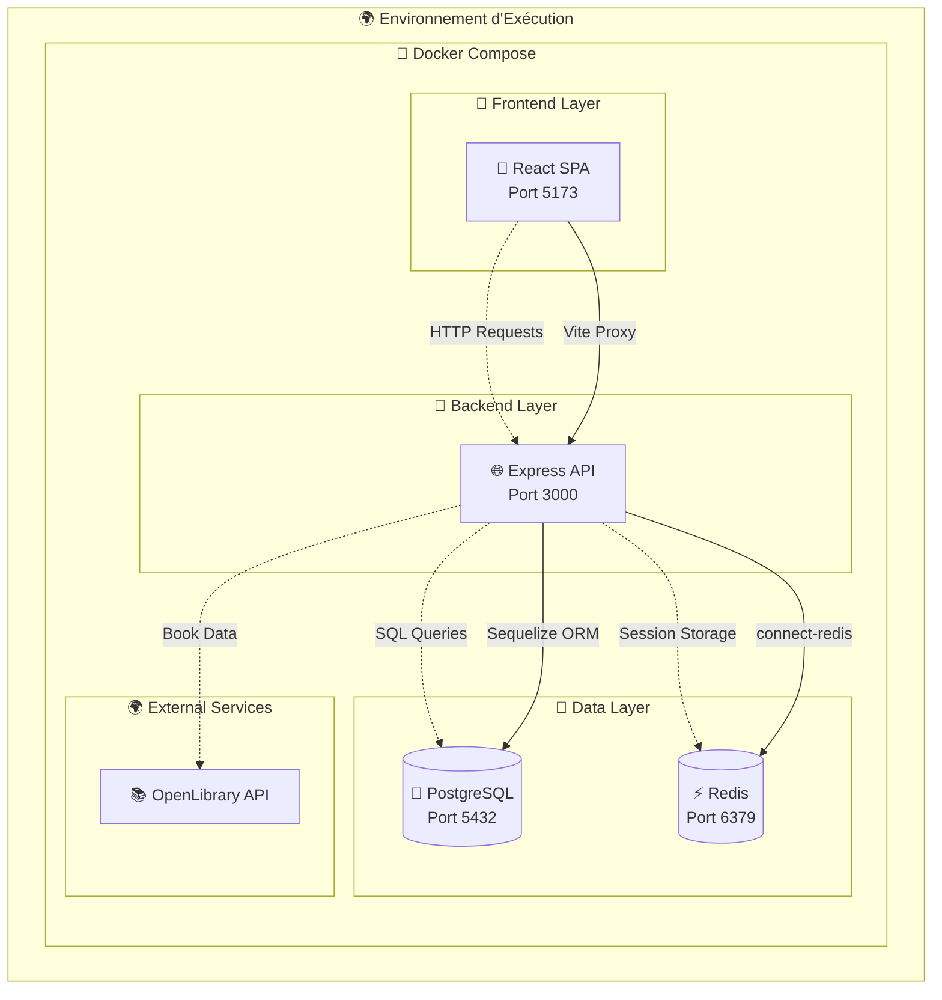
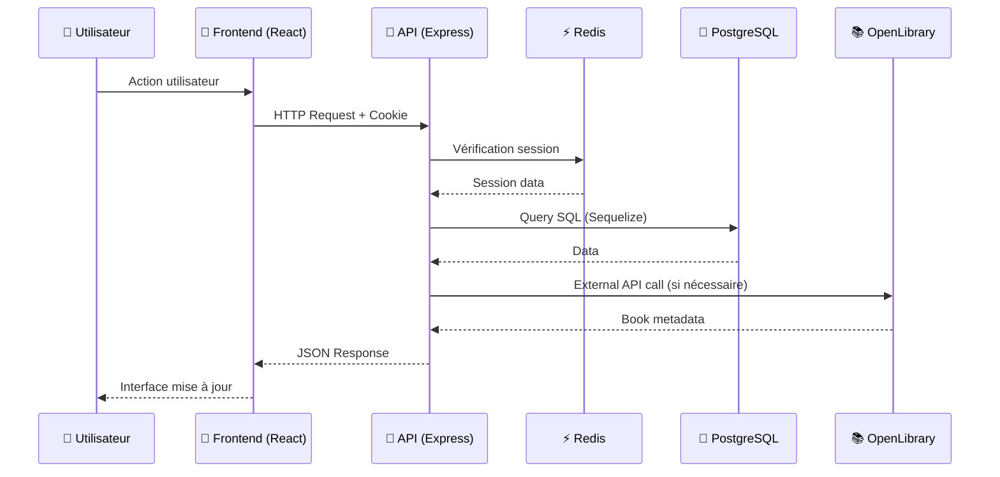
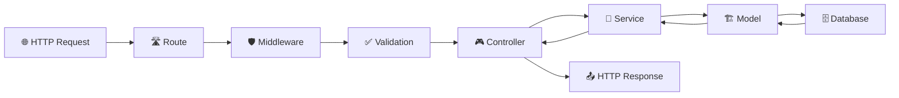
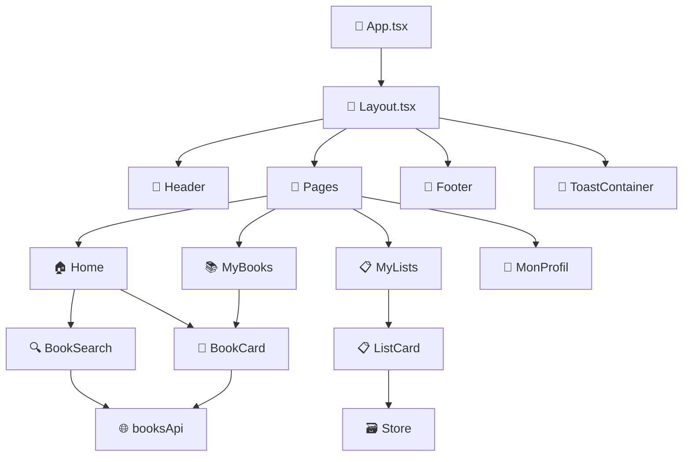
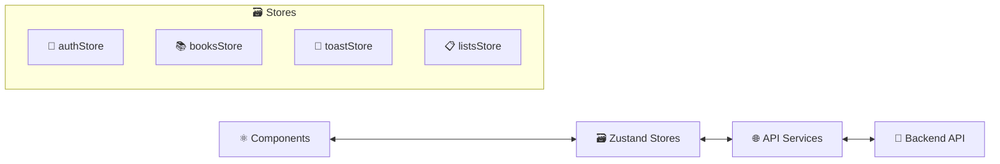
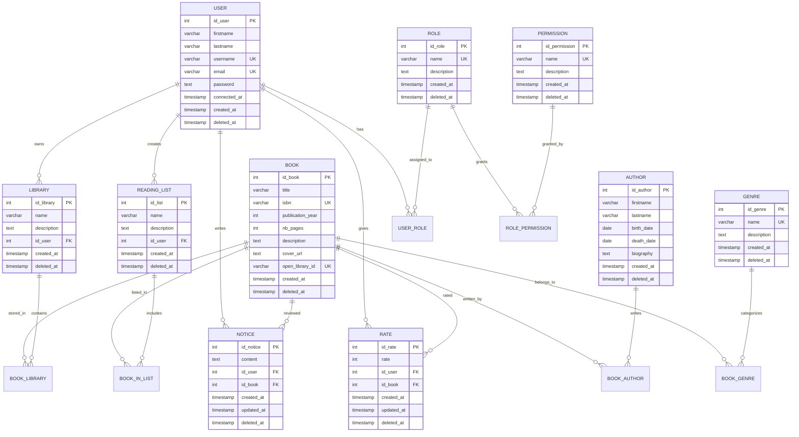
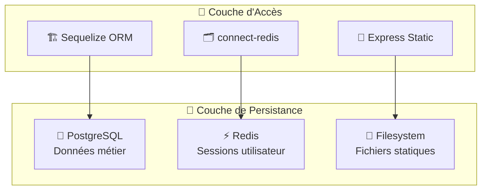
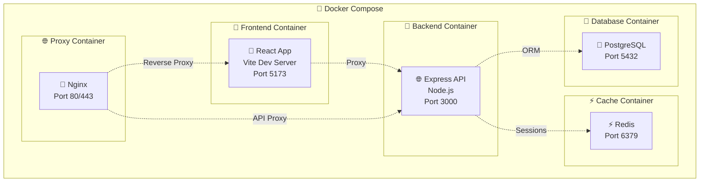
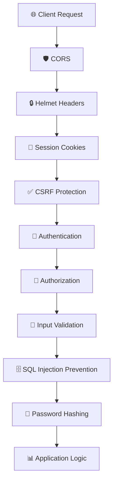
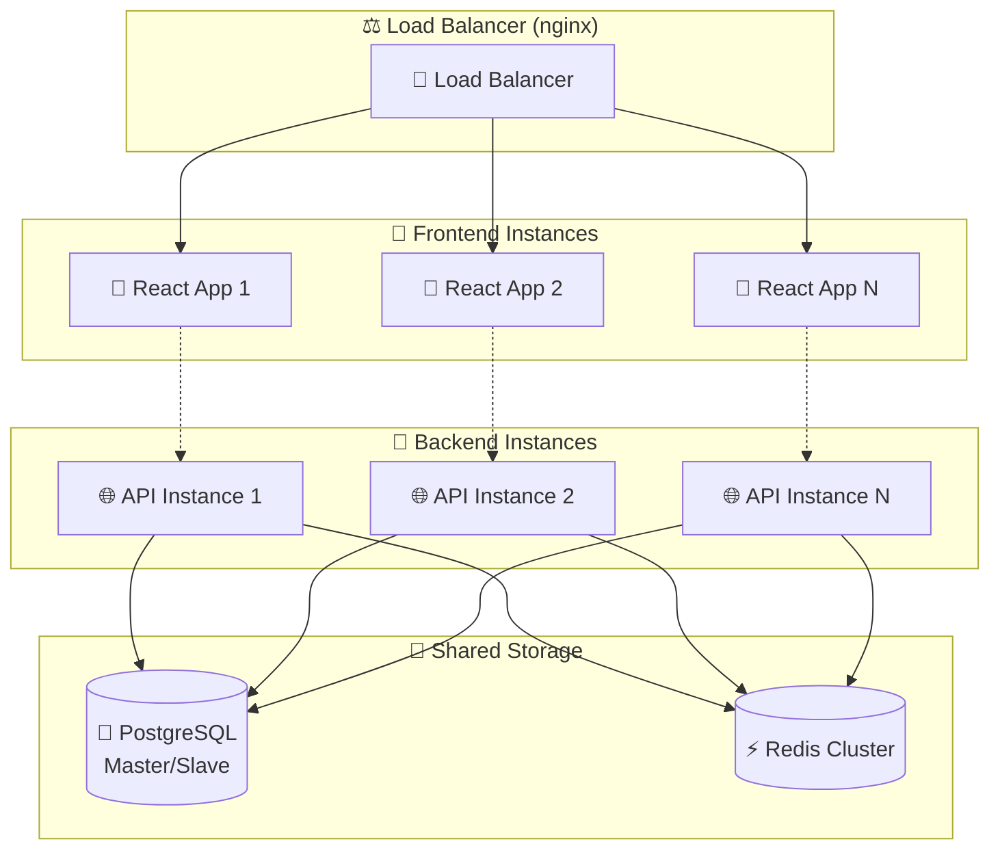

# 🏗️ Architecture Logicielle - BlaBlaBook

## 📋 Table des Matières

1. [Vue d'ensemble](#vue-densemble)
2. [Architecture Globale](#architecture-globale)
3. [Architecture Backend](#architecture-backend)
4. [Architecture Frontend](#architecture-frontend)
5. [Architecture de Données](#architecture-de-données)
6. [Patterns et Principes](#patterns-et-principes)
7. [Infrastructure et Déploiement](#infrastructure-et-déploiement)
8. [Sécurité](#sécurité)
9. [Performance et Scalabilité](#performance-et-scalabilité)

---

## 🎯 Vue d'ensemble

**BlaBlaBook** est une application web fullstack de gestion de bibliothèque personnelle suivant une **architecture multicouche** avec séparation stricte des responsabilités.

### **Caractéristiques principales :**

- 🏗️ **Architecture 3-Tiers** : Présentation / Logique Métier / Données
- 🔄 **API REST** découplée avec authentification stateful
- 🧩 **Pattern MVC** côté backend avec services métier
- ⚛️ **Architecture Component-Based** côté frontend
- 🐳 **Containerisation Docker** complète
- 🔐 **Sécurité renforcée** (Argon2, CSRF, Sessions Redis)

---

## 🌐 Architecture Globale



### **Flux de Communication :**



---

## 🔧 Architecture Backend

### **🏗️ Structure Multicouche**

```
📁 backend/src/
├── 🚪 index.ts                     # Point d'entrée
├── 🛣️  routes/                     # Couche de Routage
│   ├── auth.ts                     # Routes authentification
│   ├── books.ts                    # Routes livres
│   ├── users.ts                    # Routes utilisateurs
│   ├── library.ts                  # Routes bibliothèques
│   └── index.ts                    # Routeur principal
├── 🎮 controllers/                 # Couche de Contrôle
│   ├── AuthController.ts           # Orchestration HTTP/Sessions
│   ├── BookController.ts           # Gestion livres
│   ├── UserController.ts           # Gestion utilisateurs
│   ├── LibraryController.ts        # Gestion bibliothèques
│   ├── AuthorController.ts         # Gestion auteurs
│   ├── GenreController.ts          # Gestion genres
│   ├── NoticeController.ts         # Gestion avis
│   ├── RateController.ts           # Gestion notes
│   ├── RoleController.ts           # Gestion rôles
│   ├── PermissionController.ts     # Gestion permissions
│   └── ReadingListController.ts    # Gestion listes de lecture
├── 🔧 services/                    # Couche Métier
│   ├── AuthService.ts              # Logique authentification
│   ├── BookService.ts              # Logique livres
│   ├── UserService.ts              # Logique utilisateurs
│   ├── LibraryService.ts           # Logique bibliothèques
│   ├── OpenLibraryService.ts       # Intégration API externe
│   ├── PasswordService.ts          # Sécurité mots de passe
│   ├── AuthorService.ts            # Logique auteurs
│   ├── GenreService.ts             # Logique genres
│   ├── NoticeService.ts            # Logique avis
│   ├── RateService.ts              # Logique notes
│   ├── RoleService.ts              # Logique rôles
│   ├── PermissionService.ts        # Logique permissions
│   ├── ReadingListService.ts       # Logique listes
│   ├── UserRoleService.ts          # Gestion rôles utilisateurs
│   └── RolePermissionService.ts    # Gestion permissions rôles
├── 🛡️  middlewares/                # Couche Middleware
│   ├── sessionMiddleware.ts        # Gestion sessions Redis
│   └── validationMiddlewares.ts    # Validation Zod
├── 🏗️  models/                     # Couche d'Accès aux Données
│   ├── User.ts                     # Modèle utilisateur
│   ├── Books.ts                    # Modèle livres
│   ├── Authors.ts                  # Modèle auteurs
│   ├── Genre.ts                    # Modèle genres
│   ├── Library.ts                  # Modèle bibliothèques
│   ├── ReadingList.ts              # Modèle listes de lecture
│   ├── Notice.ts                   # Modèle avis
│   ├── Rate.ts                     # Modèle notes
│   ├── Role.ts                     # Modèle rôles
│   ├── Permissions.ts              # Modèle permissions
│   ├── UserRole.ts                 # Modèle liaison user-role
│   ├── RolePermission.ts           # Modèle liaison role-permission
│   └── association.ts              # Relations Sequelize
├── 🗄️  db/                         # Configuration Base de Données
│   └── sequelize.ts                # Configuration ORM
├── 📜 scripts/                     # Scripts utilitaires
│   ├── createTables.ts             # Création tables
│   └── seedTables.ts               # Données de test
├── ✅ validation/                  # Schémas de validation
└── 🧪 test/                        # Tests
    └── testAuth.ts                 # Tests architecture
```

### **🔄 Flux de Traitement d'une Requête**



### **🎯 Responsabilités par Couche**

| Couche             | Responsabilité                       | Exemple                          |
| ------------------ | ------------------------------------ | -------------------------------- |
| **🛣️ Routes**      | Point d'entrée HTTP, routage         | `POST /api/auth/login`           |
| **🛡️ Middlewares** | Validation, authentification, CORS   | `requireAuth`, `validateLogin`   |
| **🎮 Controllers** | Orchestration HTTP, gestion sessions | `AuthController.login()`         |
| **🔧 Services**    | Logique métier, règles business      | `AuthService.authenticateUser()` |
| **🏗️ Models**      | Accès données, mapping ORM           | `User.findOne()`                 |
| **🗄️ Database**    | Persistance des données              | PostgreSQL + Redis               |

---

## ⚛️ Architecture Frontend

### **🏗️ Structure Component-Based**

```
📁 frontend/src/
├── 🚪 main.tsx                     # Point d'entrée React
├── 🎯 App.tsx                      # Configuration routage
├── 📄 pages/                       # Pages principales
│   ├── Layout.tsx                  # Layout principal
│   ├── Home/                       # Page d'accueil
│   ├── Login/                      # Authentification
│   ├── Register/                   # Inscription
│   ├── MonProfil/                  # Profil utilisateur
│   ├── MyBooks/                    # Mes livres
│   ├── MaBiblio/                   # Ma bibliothèque
│   ├── MyLists/                    # Mes listes
│   ├── Genre/                      # Genres de livres
│   ├── DetailsLivre/               # Détails d'un livre
│   └── NotFound/                   # Page 404
├── 🧩 components/                  # Composants réutilisables
│   ├── layout/                     # Composants de structure
│   │   ├── Header/                 # En-tête navigation
│   │   └── Footer/                 # Pied de page
│   ├── ui/                         # Composants d'interface
│   │   ├── Modal/                  # Modales
│   │   ├── Toast/                  # Notifications
│   │   ├── BookCard/               # Carte de livre
│   │   └── BookSearch/             # Recherche de livres
│   └── common/                     # Composants métier
│       ├── NavBar/                 # Navigation
│       ├── ListCard/               # Carte de liste
│       ├── LibraryNav/             # Navigation bibliothèque
│       └── ToggleRead/             # Statut de lecture
├── 🗃️  store/                      # Gestion d'état (Zustand)
│   ├── authStore.ts                # État authentification
│   ├── addBook.ts                  # État livres
│   ├── toastStore.ts               # État notifications
│   ├── myListsStore.ts             # État listes
│   └── listDetailStore.ts          # État détails listes
├── 🌐 api/                         # Services API
│   ├── axiosConfig.ts              # Configuration HTTP
│   └── booksApi.ts                 # Service livres
├── 🎨 styles/                      # Styles globaux
├── 🧪 test/                        # Tests
└── 📝 Types/                       # Types TypeScript
```

### **🔄 Architecture de Composants**



### **🗃️ Gestion d'État Centralisée**



---

## 🗄️ Architecture de Données

### **🏗️ Schéma de Base de Données**



### **📊 Tables de Liaison (Many-to-Many)**

| Table               | Relation           | Colonnes Clés                             |
| ------------------- | ------------------ | ----------------------------------------- |
| **USER_ROLE**       | User ↔ Role        | `id_user`, `id_role`                      |
| **ROLE_PERMISSION** | Role ↔ Permission  | `id_role`, `id_permission`                |
| **BOOK_AUTHOR**     | Book ↔ Author      | `id_book`, `id_author`                    |
| **BOOK_GENRE**      | Book ↔ Genre       | `id_book`, `id_genre`                     |
| **BOOK_LIBRARY**    | Book ↔ Library     | `id_book`, `id_library`, `reading_status` |
| **BOOK_IN_LIST**    | Book ↔ ReadingList | `id_book`, `id_list`                      |

### **🗄️ Système de Stockage**



---

## 🎨 Patterns et Principes

### **🏗️ Design Patterns Utilisés**

#### **1. 🎮 MVC (Model-View-Controller)**

```typescript
// Exemple : Authentification
Route (/api/auth/login)
  → Middleware (validation)
  → Controller (AuthController.login)
  → Service (AuthService.authenticateUser)
  → Model (User.findOne)
  → Database (PostgreSQL)
```

#### **2. 🛡️ Repository Pattern**

```typescript
// Services agissent comme des repositories
class BookService {
  static async findByISBN(isbn: string): Promise<Book | null> {
    return await Book.findOne({ where: { isbn } });
  }
}
```

#### **3. 🏭 Factory Pattern**

```typescript
// Services factory pour OpenLibrary
class OpenLibraryService {
  static createBookFromOLData(olData: any): BookData {
    return {
      title: olData.title,
      authors: olData.authors?.map((a) => a.name) || [],
      // ...
    };
  }
}
```

#### **4. 🧩 Component Pattern (Frontend)**

```tsx
// Composants React réutilisables
const BookCard: React.FC<BookCardProps> = ({ book, onRemove }) => {
  return (
    <div className="book-card">
      <h3>{book.title}</h3>
      <button onClick={() => onRemove(book)}>Supprimer</button>
    </div>
  );
};
```

#### **5. 🗃️ State Management Pattern**

```typescript
// Zustand store pattern
export const useAuthStore = create<AuthState>((set) => ({
  user: null,
  login: async (credentials) => {
    const user = await authApi.login(credentials);
    set({ user });
  },
}));
```

### **📏 Principes SOLID**

| Principe                  | Application                               | Exemple                                          |
| ------------------------- | ----------------------------------------- | ------------------------------------------------ |
| **S**ingle Responsibility | Chaque classe a une responsabilité unique | `AuthService` → authentification uniquement      |
| **O**pen/Closed           | Extensions sans modifications             | Nouveaux contrôleurs sans modifier les existants |
| **L**iskov Substitution   | Interfaces cohérentes                     | Tous les services respectent le même pattern     |
| **I**nterface Segregation | Interfaces spécialisées                   | `AuthState`, `BookState` séparés                 |
| **D**ependency Inversion  | Dépendances abstraites                    | Services injectés dans les contrôleurs           |

---

## 🐳 Infrastructure et Déploiement

### **🏗️ Architecture Docker**



### **📁 Configuration Docker**

```yaml
# docker-compose.dev.yml
services:
  client:
    build: ./frontend
    ports: ["5173:5173"]
    volumes: ["./frontend:/app"]

  api:
    build: ./backend
    ports: ["3000:3000"]
    volumes: ["./backend:/app"]
    depends_on: [db, redis]

  db:
    image: postgres:15
    environment:
      POSTGRES_DB: blablabook
      POSTGRES_USER: postgres
      POSTGRES_PASSWORD: password
    ports: ["5432:5432"]

  redis:
    image: redis:7-alpine
    ports: ["6379:6379"]
```

### **🚀 Environnements**

| Environnement      | Configuration             | Domaine          |
| ------------------ | ------------------------- | ---------------- |
| **🛠️ Development** | `docker-compose.dev.yml`  | `localhost:5173` |
| **🏭 Production**  | `docker-compose.prod.yml` | `blablabook.com` |
| **🧪 Testing**     | `docker-compose.test.yml` | `localhost:test` |

---

## 🔐 Sécurité

### **🛡️ Mesures de Sécurité Implémentées**



#### **🔐 Authentification & Autorisation**

```typescript
// Sessions Redis sécurisées
export const sessionConfig = session({
  store: redisStore,
  name: "blablabook_session",
  secret: process.env.SESSION_SECRET,
  cookie: {
    secure: process.env.NODE_ENV === "production", // HTTPS en prod
    httpOnly: true, // Protection XSS
    maxAge: 24 * 60 * 60 * 1000, // 24h
    sameSite: "lax", // Protection CSRF
  },
});

// Hachage Argon2
class PasswordService {
  static async hashPassword(password: string): Promise<string> {
    return await argon2.hash(password, {
      type: argon2.argon2id,
      memoryCost: 2 ** 16,
      timeCost: 3,
      parallelism: 1,
    });
  }
}
```

#### **🛡️ Protection des Headers**

```typescript
// Configuration Helmet
app.use(
  helmet({
    contentSecurityPolicy: {
      directives: {
        defaultSrc: ["'self'"],
        scriptSrc: ["'self'", "'unsafe-inline'"],
        styleSrc: ["'self'", "'unsafe-inline'"],
        imgSrc: ["'self'", "data:", "https:"],
      },
    },
    hsts: {
      maxAge: 31536000,
      includeSubDomains: true,
      preload: true,
    },
  })
);
```

#### **✅ Validation des Données**

```typescript
// Schémas Zod pour validation type-safe
const loginSchema = z.object({
  email: z.string().email("Format email invalide"),
  password: z.string().min(6, "6 caractères minimum"),
});

// Middleware de validation
export const validateLogin = (
  req: Request,
  res: Response,
  next: NextFunction
) => {
  try {
    loginSchema.parse(req.body);
    next();
  } catch (error) {
    res.status(400).json({ success: false, errors: error.errors });
  }
};
```

### **🔒 Niveaux de Sécurité**

| Niveau                | Protection                  | Technologie            |
| --------------------- | --------------------------- | ---------------------- |
| **🌐 Transport**      | HTTPS, TLS 1.3              | Let's Encrypt, nginx   |
| **🍪 Session**        | Cookies sécurisés, HttpOnly | Redis, express-session |
| **🔑 Authentication** | Hash Argon2, Salt           | argon2, crypto         |
| **👤 Authorization**  | RBAC, Permissions           | Custom middleware      |
| **📝 Input**          | Validation stricte          | Zod, express-validator |
| **🗄️ Database**       | Prepared statements         | Sequelize ORM          |
| **🛡️ Headers**        | Security headers            | Helmet.js              |

---

## ⚡ Performance et Scalabilité

### **🚀 Optimisations Performance**

#### **📊 Backend**

```typescript
// Pagination pour limiter les résultats
export class BookService {
  static async getAllBooks(filters: BookFilters) {
    const { limit = 20, offset = 0 } = filters;

    return await Book.findAndCountAll({
      limit,
      offset,
      include: [Author, Genre],
      order: [['created_at', 'DESC']]
    });
  }
}

// Cache Redis pour les sessions
const redisStore = new RedisStore({
  client: redisClient,
  prefix: "blablabook:sess:",
  ttl: 86400 // 24h
});

// Indexation base de données
CREATE INDEX idx_user_email ON USER(email);
CREATE INDEX idx_book_isbn ON BOOK(isbn);
CREATE INDEX idx_library_user ON LIBRARY(id_user);
```

#### **⚛️ Frontend**

```typescript
// Lazy loading des composants
const MyBooks = lazy(() => import("./pages/MyBooks/MyBooks"));
const MyLists = lazy(() => import("./pages/MyLists/MyLists"));

// Optimisation des re-renders
const BookCard = memo(({ book, onRemove }: BookCardProps) => {
  const handleRemove = useCallback(() => {
    onRemove(book);
  }, [book, onRemove]);

  return <div className="book-card">...</div>;
});

// State management optimisé
export const useMyBooksStore = create<BookState>((set, get) => ({
  books: [],
  loading: false,

  // Batch updates pour éviter les re-renders multiples
  updateBooks: (newBooks: Book[]) => set({ books: newBooks, loading: false }),
}));
```

### **📈 Métriques de Performance**

| Métrique                      | Cible   | Mesure           |
| ----------------------------- | ------- | ---------------- |
| **🕐 Time to First Byte**     | < 200ms | Response backend |
| **🎨 First Contentful Paint** | < 1.5s  | Rendu initial    |
| **📱 Mobile Page Speed**      | > 90    | Lighthouse score |
| **🗄️ Database Query Time**    | < 100ms | Queries moyennes |
| **⚡ Redis Response Time**    | < 10ms  | Cache access     |

### **🔄 Scalabilité Horizontale**



---

## 📊 Métriques et Monitoring

### **📈 KPIs Techniques**

```typescript
// Monitoring intégré
export class PerformanceService {
  static startTimer(operation: string): () => void {
    const start = Date.now();
    return () => {
      const duration = Date.now() - start;
      console.log(`⏱️ ${operation}: ${duration}ms`);
    };
  }

  static async logDatabaseQuery(query: string, duration: number) {
    if (duration > 100) {
      console.warn(`🐌 Slow query (${duration}ms): ${query}`);
    }
  }
}

// Health checks
app.get("/health", (req, res) => {
  res.status(200).json({
    status: "OK",
    timestamp: new Date().toISOString(),
    services: {
      database: "connected",
      redis: "connected",
      external_api: "available",
    },
  });
});
```

### **🎯 Métriques Business**

| Métrique                   | Description                 | Seuil   |
| -------------------------- | --------------------------- | ------- |
| **👤 Utilisateurs actifs** | Connexions par jour         | > 100   |
| **📚 Livres ajoutés**      | Nouveaux livres par semaine | > 50    |
| **📋 Listes créées**       | Nouvelles listes par mois   | > 20    |
| **⭐ Notes moyennes**      | Score satisfaction          | > 4.0/5 |
| **🔄 Taux de rétention**   | Utilisateurs qui reviennent | > 70%   |

---

## 🎯 Conclusion

**BlaBlaBook** implémente une **architecture logicielle moderne et robuste** qui respecte les meilleures pratiques du développement web :

### **✅ Points Forts**

- 🏗️ **Architecture multicouche** claire et maintenable
- 🔐 **Sécurité renforcée** avec authentification stateful
- ⚡ **Performance optimisée** avec cache Redis et pagination
- 🧪 **Testabilité** grâce à la séparation des responsabilités
- 🐳 **Containerisation** complète pour le déploiement
- 📊 **Monitoring** intégré pour la supervision

### **🔄 Évolutions Futures**

- 📱 **Application mobile** (React Native)
- 🔍 **Recherche avancée** (Elasticsearch)
- 📧 **Notifications** en temps réel (WebSockets)
- 🌍 **Multi-langue** (i18n)
- 📊 **Analytics** avancées (Grafana)
- 🤖 **Recommandations** ML (TensorFlow)

Cette architecture offre une **base solide** pour l'évolution et la montée en charge de l'application BlaBlaBook. 🚀

---

## 🚀 Checklist Déploiement Production

### **✅ État Actuel du Projet**

Votre projet BlaBlaBook est **techniquement prêt** pour la production avec :

- ✅ **Docker Compose Production** configuré (`docker-compose.prod.yml`)
- ✅ **Dockerfiles optimisés** pour production (multi-stage builds)
- ✅ **Configuration Nginx** avec proxy API et HTTPS
- ✅ **Architecture sécurisée** (Argon2, Sessions Redis, CORS)
- ✅ **Build pipeline** frontend/backend fonctionnel

### **🔧 Ce qu'il reste à finaliser**

#### **1. 🌍 Configuration d'Environnement Production**

```bash
# Créer .env.production avec valeurs réelles
NODE_ENV=production
DB_HOST=postgres
DB_PORT=5432
DB_USER=blablabook_user
DB_PASSWORD=YOUR_SECURE_PASSWORD
DB_NAME=blablabook_prod
POSTGRES_USER=blablabook_user
POSTGRES_PASSWORD=YOUR_SECURE_PASSWORD
POSTGRES_DB=blablabook_prod
REDIS_URL=redis://redis:6379
SESSION_SECRET=YOUR_SUPER_SECURE_64_CHAR_SECRET
FRONTEND_URL=https://yourdomain.com
```

#### **2. 🔐 Certificats SSL**

```bash
# Option A: Let's Encrypt (production réelle)
certbot certonly --webroot -w /var/www/html -d yourdomain.com

# Option B: Auto-signés (test local)
mkdir -p servers/ssl
openssl req -x509 -nodes -days 365 -newkey rsa:2048 \
  -keyout servers/ssl/localhost.key \
  -out servers/ssl/localhost.crt
```

#### **3. ⚡ Optimisations Frontend Production**

```typescript
// vite.config.ts - Optimisations production
export default defineConfig({
  build: {
    minify: "terser",
    sourcemap: false,
    chunkSizeWarningLimit: 1000,
    rollupOptions: {
      output: {
        manualChunks: {
          vendor: ["react", "react-dom"],
          router: ["react-router-dom"],
          store: ["zustand"],
          ui: ["react-icons"],
        },
      },
    },
  },
});
```

#### **4. 🏥 Health Checks Docker**

```yaml
# Ajouter dans docker-compose.prod.yml
services:
  api:
    healthcheck:
      test: ["CMD", "curl", "-f", "http://localhost:3000/health"]
      interval: 30s
      timeout: 10s
      retries: 3
      start_period: 40s

  postgres:
    healthcheck:
      test: ["CMD-SHELL", "pg_isready -U $POSTGRES_USER -d $POSTGRES_DB"]
      interval: 10s
      timeout: 5s
      retries: 5
```

#### **5. 🔒 Gestion des Secrets**

```yaml
# docker-compose.prod.yml avec secrets
secrets:
  db_password:
    file: ./secrets/db_password.txt
  session_secret:
    file: ./secrets/session_secret.txt

services:
  api:
    secrets:
      - db_password
      - session_secret
    environment:
      - DB_PASSWORD_FILE=/run/secrets/db_password
```

#### **6. 📜 Scripts de Déploiement**

```bash
#!/bin/bash
# deploy.sh - Script de déploiement automatisé

echo "🚀 Déploiement BlaBlaBook Production"

# 1. Backup base de données
docker exec postgres pg_dump -U $POSTGRES_USER $POSTGRES_DB > backup_$(date +%Y%m%d_%H%M%S).sql

# 2. Build images fraîches
docker compose -f docker-compose.prod.yml build --no-cache

# 3. Déploiement avec zero-downtime
docker compose -f docker-compose.prod.yml up -d

# 4. Health check
sleep 30
curl -f https://localhost/health || exit 1

echo "✅ Déploiement terminé avec succès"
```

#### **7. 📊 Monitoring et Logs**

```yaml
# Ajouter logging centralisé
services:
  api:
    logging:
      driver: "json-file"
      options:
        max-size: "10m"
        max-file: "3"

  nginx:
    volumes:
      - ./logs/nginx:/var/log/nginx
```

#### **8. 🧪 Tests E2E Production**

```bash
# Série de tests post-déploiement
curl -f https://localhost/health
curl -f https://localhost/api/health
curl -f https://localhost/ # Frontend accessible
```

### **⏱️ Estimation Temps de Finalisation**

| Tâche                   | Temps estimé | Priorité     |
| ----------------------- | ------------ | ------------ |
| **Configuration .env**  | 15 min       | 🔴 Critique  |
| **Certificats SSL**     | 30 min       | 🔴 Critique  |
| **Optimisations Vite**  | 20 min       | 🟡 Important |
| **Health Checks**       | 25 min       | 🟡 Important |
| **Scripts déploiement** | 45 min       | 🟢 Optionnel |
| **Monitoring**          | 30 min       | 🟢 Optionnel |
| **Tests E2E**           | 20 min       | 🟡 Important |

**Total critique : ~1h15** pour un déploiement production fonctionnel.

### **🎯 Commandes de Déploiement**

```bash
# 1. Configuration initiale
cp .env.exemple .env.production
# Éditer .env.production avec valeurs réelles

# 2. Génération SSL (si nécessaire)
./scripts/generate-ssl.sh

# 3. Déploiement production
npm run docker:prod:build
npm run docker:prod

# 4. Vérification
curl -f https://localhost/health
curl -f https://localhost/api/health
```

### **🌟 Votre Projet est PRÊT !**

Votre architecture BlaBlaBook est **déjà excellente** pour la production. Il ne reste que des **ajustements de configuration** et quelques optimisations pour un déploiement professionnel complet ! 🎉
