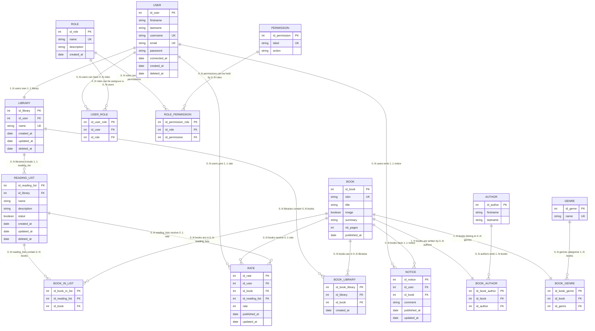

# Entity Relationship Diagram (ERD) - BlaBlaBook

Ce document présente le diagramme ERD de l'application BlaBlaBook basé sur la documentation du projet (MCD V3, MPD V2, et dictionnaire des données).

---

## Diagramme ERD



---

## Description des entités

### Entités principales

| **Entité** | **Description** | **Clé primaire** |
|------------|-----------------|------------------|
| **USER** | Utilisateurs de l'application | id_user |
| **ROLE** | Rôles du système RBAC | id_role |
| **PERMISSION** | Permissions du système | id_permission |
| **LIBRARY** | Bibliothèques personnelles | id_library |
| **READING_LIST** | Listes de lecture thématiques | id_reading_list |
| **BOOK** | Informations sur les livres | id_book |
| **AUTHOR** | Auteurs des livres | id_author |
| **GENRE** | Genres littéraires | id_genre |
| **NOTICE** | Avis/critiques sur les livres | id_notice |
| **RATE** | Notes numériques | id_rate |

### Tables de liaison (Many-to-Many)

| **Table** | **Description** | **Entités liées** |
|-----------|-----------------|-------------------|
| **USER_ROLE** | Attribution des rôles aux utilisateurs | USER ↔ ROLE |
| **ROLE_PERMISSION** | Attribution des permissions aux rôles | ROLE ↔ PERMISSION |
| **BOOK_LIBRARY** | Livres dans les bibliothèques | BOOK ↔ LIBRARY |
| **BOOK_IN_LIST** | Livres dans les listes de lecture | BOOK ↔ READING_LIST |
| **BOOK_AUTHOR** | Auteurs des livres | BOOK ↔ AUTHOR |
| **BOOK_GENRE** | Genres des livres | BOOK ↔ GENRE |

---

## Cardinalités et règles métier

### Système RBAC

- **USER ↔ ROLE** : Un utilisateur peut avoir plusieurs rôles, un rôle peut être attribué à plusieurs utilisateurs
- **ROLE ↔ PERMISSION** : Un rôle peut avoir plusieurs permissions, une permission peut être attribuée à plusieurs rôles

### Gestion des contenus

- **USER → LIBRARY** : Un utilisateur possède au minimum 1 bibliothèque (contrainte métier)
- **LIBRARY → READING_LIST** : Une bibliothèque peut contenir plusieurs listes, chaque liste appartient à une seule bibliothèque
- **LIBRARY ↔ BOOK** : Relation many-to-many permettant le partage de livres entre bibliothèques
- **READING_LIST ↔ BOOK** : Relation many-to-many permettant aux livres d'être dans plusieurs listes

### Métadonnées des livres

- **BOOK ↔ AUTHOR** : Un livre a au moins un auteur, un auteur peut écrire plusieurs livres
- **BOOK ↔ GENRE** : Un livre appartient à au moins un genre, un genre peut contenir plusieurs livres

### Évaluations

- **USER → NOTICE** : Un utilisateur peut rédiger plusieurs avis, chaque avis a un seul auteur
- **BOOK ← NOTICE** : Un livre peut avoir plusieurs avis, chaque avis concerne un seul livre
- **USER → RATE** : Un utilisateur peut donner plusieurs notes
- **BOOK/READING_LIST ← RATE** : Les notes peuvent s'appliquer aux livres ou aux listes

---

## Contraintes d'intégrité

### Clés étrangères avec CASCADE DELETE

- `LIBRARY.id_user → USER.id_user`
- `READING_LIST.id_library → LIBRARY.id_library`
- `NOTICE.id_user → USER.id_user`
- `RATE.id_user → USER.id_user`

### Clés étrangères avec RESTRICT DELETE

- `NOTICE.id_book → BOOK.id_book`
- `RATE.id_book → BOOK.id_book`

### Contraintes d'unicité

- `USER.username` et `USER.email`
- `ROLE.name`
- `PERMISSION.label`
- `BOOK.isbn`
- `LIBRARY.name`
- `GENRE.name`

### Contraintes de validation

- `RATE.rate` : CHECK (rate >= 1 AND rate <= 5)
- `BOOK.nb_pages` : CHECK (nb_pages > 0)

---

## Notes techniques

### Soft Delete

Les entités suivantes supportent la suppression logique via `deleted_at` :

- USER
- LIBRARY
- READING_LIST

### Timestamps automatiques

Toutes les entités principales incluent :

- `created_at` : Date de création
- `updated_at` : Date de dernière modification (si applicable)

### Indexation recommandée

Pour optimiser les performances :

```sql
-- Index sur les clés étrangères fréquemment utilisées
CREATE INDEX idx_notice_user ON NOTICE(id_user);
CREATE INDEX idx_notice_book ON NOTICE(id_book);
CREATE INDEX idx_rate_user ON RATE(id_user);
CREATE INDEX idx_rate_book ON RATE(id_book);
CREATE INDEX idx_library_user ON LIBRARY(id_user);
```

---

## Légende

| **Symbole** | **Signification** |
|-------------|-------------------|
| `PK` | Clé primaire (Primary Key) |
| `FK` | Clé étrangère (Foreign Key) |
| `UK` | Clé unique (Unique Key) |
| `||--||` | Relation un-à-un |
| `||--o{` | Relation un-à-plusieurs |
| `}o--o{` | Relation plusieurs-à-plusieurs |
