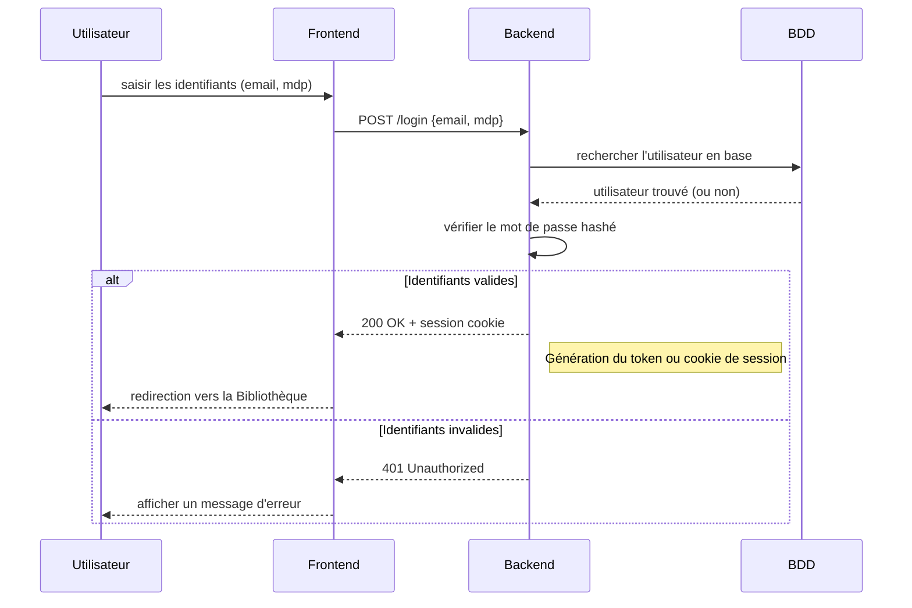
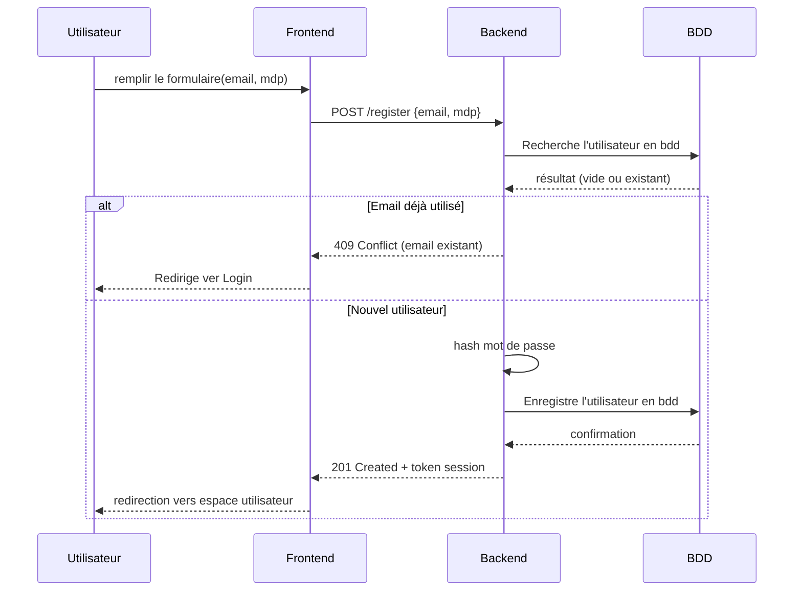
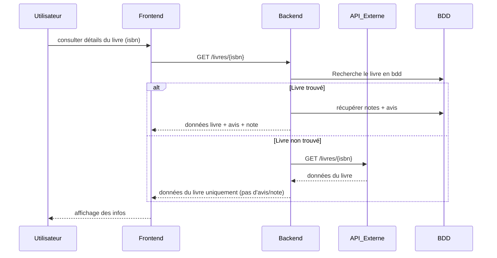
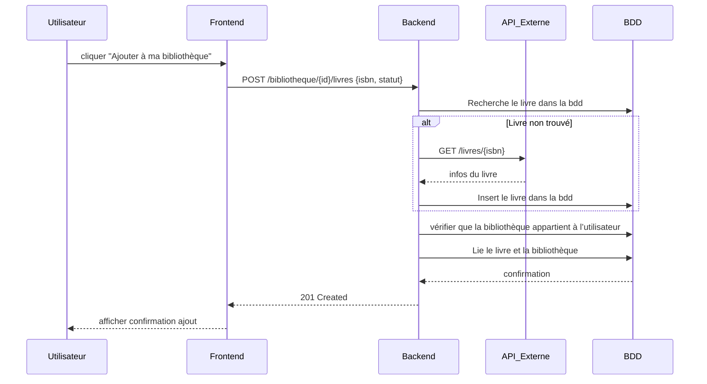
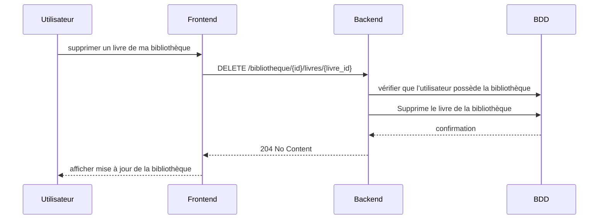
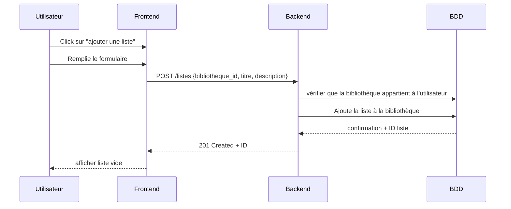
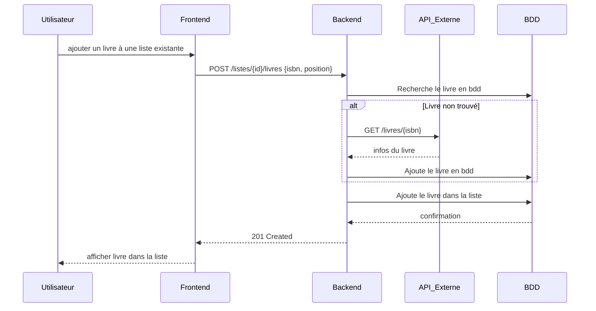

# Diagrame de Séquence et ERD

## ERD

```mermaid

erDiagram
UTILISATEUR }o--|| BIBLIOTHEQUE : possède
UTILISATEUR ||--o{ AVIS : rédige
UTILISATEUR ||--o{ NOTE : attribue
UTILISATEUR ||--o{ UTILISATEUR_ROLE : possède
ROLE ||--o{ UTILISATEUR_ROLE : estassignéà
ROLE ||--o{ ROLE_PERMISSION : dispose
PERMISSION ||--o{ ROLE_PERMISSION : estdonnéeà

BIBLIOTHEQUE ||--o{ LIVREBIBLIOTHEQUE : contient
BIBLIOTHEQUE ||--o{ LISTELECTURE : ajoute

LISTELECTURE ||--o{ LIVREDANSLISTE : regroupe
LISTELECTURE ||--o{ NOTE : reçoit

LIVRE ||--o{ LIVREBIBLIOTHEQUE : est_ajouté_dans
LIVRE ||--o{ AVIS : reçoit
LIVRE ||--o{ NOTE : reçoit
LIVRE ||--o{ LIVREDANSLISTE : figure_dans

AUTEUR ||--o{ LIVRE : écrit
GENRE ||--o{ LIVRE : classe
AUTEUR ||--o{LIVRE_AUTEUR:appartient
GENRE ||--o{ LIVRE_GENRE: détermine

UTILISATEUR {
  int id
  string nom
  string prenom
  string pseudo
  string email
  string mot_de_passe
  datetime date_creation
}

ROLE {
  int id
  string nom
  string description
}

PERMISSION {
  int id
  string nom
  string description
}

UTILISATEUR_ROLE {
  int id
  int utilisateur_id
  int role_id
}

ROLE_PERMISSION {
  int id
  int role_id
  int permission_id
}

BIBLIOTHEQUE {
  int id
  int utilisateur_id
  int livre_id
}

LIVRE {
  int isbn
  string auteur
  string titre
  string description
  string url_image
  string categorie
  string date
}

AUTEUR {
int id
string firstname
string lastname
}

LIVRE_AUTEUR {
int id
int id livre_id
int id auteur_id
}

GENRE {
int id
string name
}

LIVRE_GENRE {
int id
int livre_id
int genre_id
}

LIVREBIBLIOTHEQUE {
  int id
  int bibliotheque_id
  int livre_id
  string statut
  datetime date_ajout
}

AVIS {
  int id
  int utilisateur_id
  int livre_id
  string commentaire
  datetime date_creation
}

LISTELECTURE {
  int id
  int bibliotheque_id
  string titre
  string description
  boolean publique
  datetime date_creation
}

LIVREDANSLISTE {
  int id
  int liste_lecture_id
  int livre_id
}

NOTE {
  int id
  int utilisateur_id
  int liste_lecture_id
  int livre_id
  int note
  datetime date_creation
}


````

## Diagramme de Séquence

### Rechercher un livre via l'API

```mermaid
sequenceDiagram
    participant Utilisateur
    participant Frontend
    participant Backend
    participant API_Externe

    Utilisateur->>Frontend: rechercher "science fiction"
    Frontend->>Backend: GET /recherche?q=science fiction
    Backend->>API_Externe: GET /livres?q=science fiction
    API_Externe-->>Backend: liste de résultats
    Backend-->>Frontend: liste de livres
    Frontend-->>Utilisateur: afficher résultats de recherche
```

### Connexion



### Inscription



### Affichage des détails d’un livre



### Ajout d'un livre à la bibliotheque



### Supression d'un livre dans la bibliothèque



### Créer une liste de lecture



### Ajout d’un livre à une liste de lecture



### Ajoute un avis à un livre

```mermaid
sequenceDiagram
    participant Utilisateur
    participant Frontend
    participant Backend
    participant API_Externe
    participant BDD

    Utilisateur->>Frontend: rédiger un avis
    Frontend->>Backend: POST /livres/{isbn}/avis {commentaire}
    Backend->>BDD: Recherche le livre ene bdd
    alt Livre non trouvé
        Backend->>API_Externe: GET /livres/{isbn}
        API_Externe-->>Backend: infos du livre
        Backend->>BDD: Ajoute le livre en bdd
    end
    Backend->>BDD: Insert l'avie en bdd
    BDD-->>Backend: confirmation
    Backend-->>Frontend: 201 Created
    Frontend-->>Utilisateur: afficher avis publié
````

### Ajout d'une note à un livre

```mermaid
sequenceDiagram
    participant Utilisateur
    participant Frontend
    participant Backend
    participant API_Externe
    participant BDD

    Utilisateur->>Frontend: noter un livre dans une liste
    Frontend->>Backend: POST /listes/{id}/notes {isbn, note}
    Backend->>BDD: vérifier accès à la liste par l’utilisateur
    Backend->>BDD: Recherche le livre en bdd
    alt Livre non trouvé
        Backend->>API_Externe: GET /livres/{isbn}
        API_Externe-->>Backend: données du livre
        Backend->>BDD: Ajoute le livre en bdd
    end
    Backend->>BDD: lie la note au livre
    BDD-->>Backend: confirmation
    Backend-->>Frontend: 201 Created
    Frontend-->>Utilisateur: afficher note enregistrée
```
