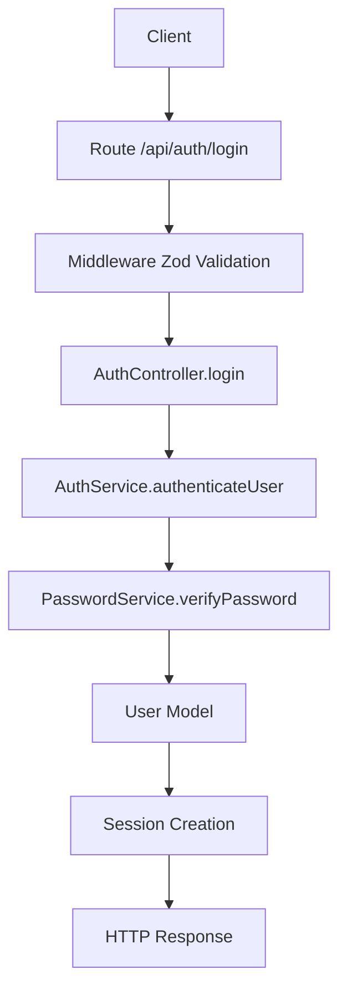

# 🎯 REFACTORISATION RÉUSSIE : ARCHITECTURE PROPRE POUR L'AUTHENTIFICATION

## 📋 Ce qui a été accompli

### ✅ 1. Séparation des responsabilités

**Avant** (tout dans le contrôleur) :

```typescript
// AuthController.ts
static async login(req, res) {
  // Validation directe
  const { email, password } = req.body;

  // Accès direct au modèle
  const user = await User.findOne({ where: { email } });

  // Logique métier dans le contrôleur
  const isValid = await PasswordService.verifyPassword(password, user.password);
  // ...
}
```

**Après** (architecture en couches) :

```typescript
// AuthController.ts - Couche HTTP
static async login(req, res) {
  const credentials = req.body;

  // Délégation au service
  const user = await AuthService.authenticateUser(credentials);

  // Gestion de session
  req.session.user = { id: user.id, email: user.email, ... };

  // Réponse HTTP
  res.status(200).json({ success: true, user });
}

// AuthService.ts - Couche métier
static async authenticateUser(credentials: LoginCredentials) {
  // Validation avec Zod
  const validCredentials = loginSchema.parse(credentials);

  // Logique métier
  const user = await User.findOne({ where: { email: validCredentials.email } });

  if (!user || !await PasswordService.verifyPassword(validCredentials.password, user.password)) {
    throw new AuthError("Credentials invalides", "INVALID_CREDENTIALS", 401);
  }

  return { id: user.id, email: user.email, ... };
}
```

### ✅ 2. Gestion d'erreurs améliorée

**Classe d'erreur personnalisée** :

```typescript
export class AuthError extends Error {
  constructor(message: string, public code: string, public statusCode: number) {
    super(message);
    this.name = "AuthError";
  }
}
```

**Utilisation dans le contrôleur** :

```typescript
catch (error) {
  if (error instanceof AuthError) {
    res.status(error.statusCode).json({
      success: false,
      message: error.message,
      code: error.code
    });
    return;
  }
  // Gestion des erreurs inattendues...
}
```

### ✅ 3. Validation avec Zod

**Types TypeScript automatiques** :

```typescript
import { z } from "zod";

const registerSchema = z.object({
  email: z.string().email("Email invalide"),
  password: z.string().min(8, "Mot de passe trop court"),
  username: z.string().min(3, "Nom d'utilisateur trop court"),
  firstname: z.string().min(2, "Prénom requis"),
  lastname: z.string().min(2, "Nom requis"),
});

type RegisterData = z.infer<typeof registerSchema>;
```

## 🏗️ Architecture finale

```
📁 backend/src/
├── 🎮 controllers/
│   └── AuthController.ts          # Couche HTTP - Sessions
├── 🔧 services/
│   ├── AuthService.ts             # Couche métier - Logique
│   └── PasswordService.ts         # Service utilitaire - Sécurité
├── 🛡️ middlewares/
│   ├── sessionMiddleware.ts       # Gestion des sessions Redis
│   └── zodValidation.ts           # Validation Zod
├── 🛣️ routes/
│   └── auth.ts                    # Routes d'authentification
└── 🧪 test/
    └── testAuthArchitectureClean.ts # Tests d'architecture
```

## 🔄 Flux de traitement d'une requête



## 🎯 Avantages de cette architecture

### 1. **Séparation claire des responsabilités**

- **Contrôleur** : Gestion HTTP, sessions, réponses
- **Service** : Logique métier, validation, orchestration
- **Utilitaires** : Fonctions spécialisées (hash, crypto...)

### 2. **Testabilité améliorée**

- Services testables indépendamment
- Mocking facile des dépendances
- Tests unitaires ciblés

### 3. **Maintenance facilitée**

- Code organisé et prévisible
- Modifications localisées
- Réutilisabilité des services

### 4. **Sécurité renforcée**

- Validation centralisée avec Zod
- Gestion d'erreurs cohérente
- Types TypeScript stricts

## 🔮 Prochaines étapes

1. **Installation des dépendances** :

   ```bash
   npm install express-session connect-redis redis cors
   npm install -D @types/express-session
   ```

2. **Configuration de l'environnement** :

   ```env
   REDIS_URL=redis://localhost:6379
   SESSION_SECRET=votre_secret_session_super_secure
   ```

3. **Tests d'intégration** :

   - Tester le flux complet d'authentification
   - Vérifier la persistance des sessions
   - Valider la sécurité CSRF

4. **Autres contrôleurs** :
   - BookController avec même architecture
   - LibraryController
   - UserController pour la gestion des profils

## 💡 Points clés pour le jury CDA

- **Architecture en couches** : Séparation claire des responsabilités
- **Bonnes pratiques** : Validation, gestion d'erreurs, sécurité
- **TypeScript** : Types stricts et interfaces bien définies
- **Choix techniques justifiés** : Cookie-session vs JWT pour la simplicité
- **Code maintenable** : Lisible, documenté, organisé
