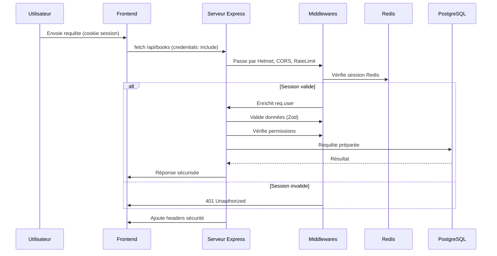

# 🔄 Parcours d'une requête sécurisée étape par étape

## ÉTAPE 1 : L'utilisateur fait une requête

```js
// Frontend (React/Vue/Angular)
fetch('/api/books', {
method: 'POST',
headers: { 'Content-Type': 'application/json' },
credentials: 'include', // ⚠️ CRUCIAL pour envoyer les cookies de session
body: JSON.stringify({ title: "Nouveau livre" })
})
```

Techno : Navigateur Web (Browser)
Action : Envoi automatique du cookie de session blablabook.sid

## ÉTAPE 2 : Réception par le serveur

```js
// Express.js reçoit la requête
app.use('/api', apiRoutes);
```

Techno : Express.js (Framework Node.js)
Action : Parse les headers HTTP et le cookie de session

## ÉTAPE 3 : Middleware de sécurité HELMET

```js
app.use(helmetOptions); // Protection headers
```

Techno : Helmet.js
Action : Ajoute les headers de sécurité

```js
X-Content-Type-Options: nosniff
X-Frame-Options: SAMEORIGIN
Content-Security-Policy: default-src 'self'
```

Protection : XSS, Clickjacking, MIME sniffing

## ÉTAPE 4 : Vérification CORS

```js
app.use(cors(corsOptions));
```

Techno : CORS Middleware
Action : Vérifie l'origine de la requête

```js
corsOptions = {
origin: ['http://localhost:3000', 'https://monapp.com'],
credentials: true // Autorise les cookies
}
```

Protection : Requêtes cross-origin malveillantes

## ÉTAPE 5 : Protection Rate Limiting

```js
app.use('/api/auth/login', authRateLimit);
Techno : Express-rate-limit📋 Action : Compte les tentatives par IP
authRateLimit = {
windowMs: 15 * 60 * 1000, // 15 minutes
max: 5, // 5 tentatives max
message: 'Too many attempts'
}
```

Protection : Attaques brute force

## ÉTAPE 6 : Récupération de la session

```js
app.use(session(sessionConfig));
```

Techno : Express-session + Connect-Redis
Action : Lit le cookie blablabook.sid=abc123...
                Interroge Redis avec cette clé
                Récupère les données de session

```js
// Redis lookup
const sessionData = await redisClient.get('sess:abc123...');
// Résultat :
{
userId: 42,
email: 'user@example.com',
username: 'johndoe',
isAuthenticated: true,
loginTime: '2024-01-15T10:30:00Z'
}
```

Protection : Sessions sécurisées, révocation possible

## ÉTAPE 7 : Vérification d'authentification

```js
export const authenticateToken = (req, res, next) => {
console.log('🚨 MIDDLEWARE AUTH - URL:', req.url);

 // Vérification session Redis  if (!req.session.userId) {      return res.status(401).json({          error: 'Authentication required'      });  } 
//  Enrichissement de la requête  req.user = {      id_user: req.session.userId,      email: req.session.email,      username: req.session.username  };  next();
};
```

Techno : Middleware custom + Redis
Action : Vérifie si req.session.userId existe
                Enrichit req.user avec les infos utilisateur
                Autorise ou rejette (401) la requête
Protection : Accès non autorisé

## ÉTAPE 8 : Validation des données

```js
router.post('/',
authenticateToken, // ← Déjà passé ✅
validateBody(createBookSchema), // ← Maintenant
createBook
);
```

Techno : Zod Validator
Action :

```js
const createBookSchema = z.object({
title: z.string().min(1).max(255),
isbn: z.string().regex(/^[0-9-X]{10,17}$/),
publication_year: z.number().int().min(1000)
});

// Validation automatique
req.body = await schema.parseAsync(req.body);
```

Protection : Injection SQL, données malformées, XSS

## ÉTAPE 9 : Vérification des permissions métier

```js
export const createBook = async (req: AuthenticatedRequest, res, next) => {
// req.user est garanti d'exister

  // Vérification optionnelle des rôles  if (req.user.role !== 'admin' && restrictedOperation) {      return res.status(403).json({          error: 'Insufficient permissions'      });  }  // Logique métier...
};
```

Techno : Logique custom + Base de données
Action : Vérifie les autorisations spécifiques
Protection : Escalade de privilèges

## (NOUVEAU) ÉTAPE 9b : Middleware Ownership (Contrôle du propriétaire)

```ts
// Exemple générique
router.put('/libraries/:id_library',
    authenticateToken,
    requirePermission('UPDATE_LIBRARY'),
    requireOwnership({
        model: Library,
        idLocation: 'params',
        idKey: 'id_library',
        ownerField: 'id_user',
        attachAs: 'library'
    }),
    updateLibraryController
);
```

Technos : Middleware custom + Sequelize (lookup PK)

Action :
 
1. Récupère l'identifiant de ressource (params/body/query)
2. Charge la ressource (findByPk)
3. Retourne 404 si inexistante (ne divulgue pas propriétaire)
4. Vérifie si l'utilisateur courant est le propriétaire (colonne `id_user`) ou admin
5. Retourne 403 si non autorisé
6. Attache la ressource validée sur `req.library` (ou autre) pour le contrôleur

Analogie simple :
Pense à une consigne de gare avec des casiers. L'authentification te laisse entrer dans la salle (tu as un badge valide). Les permissions (Étape 9) disent si tu as le droit d'utiliser certains types de casiers (ex: casiers premium). Le middleware Ownership vérifie que la clé métallique que tu présentes ouvre bien TON casier, pas celui d'un autre voyageur. Si la clé ne correspond pas, tu ne vois pas le contenu du casier et on te bloque (403). Si le casier n'existe pas, on te répond comme si tu t'étais trompé de numéro (404) — sans révéler quoi que ce soit d'autre.

Sécurité :
 
- Ne remplace pas le Zero Trust initial, il raffine l'autorisation (ABAC basique).
- Réduit la duplication de logique fragile dans les contrôleurs.
- Facilite l'audit (on peut logguer un événement unique `ownership_check`).
- Préserve la stratégie de non divulgation (404 avant 403 sur ressource inexistante).

Exemples de ressources concernées : Libraries, Rates, Notices, ReadingList entries.

Cas exclus : Import lazy (open_library_key) — pas de propriétaire direct, ownership non appliqué.

Tests recommandés :
 
- 200 propriétaire
- 403 autre utilisateur
- 200 admin (bypass)
- 404 id inconnu
- 400 id manquant

Protection : Accès non autorisé à des ressources d'un autre utilisateur (horizontal privilege escalation)

## ÉTAPE 10 : Interaction base de données sécurisée

```js
// Requête préparée automatique (Sequelize)
const book = await Book.create({
title: req.body.title, // ← Déjà validé ✅
isbn: req.body.isbn, // ← Déjà validé ✅
user_id: req.user.id_user // ← Authentifié ✅
});

```

Techno : Sequelize ORM + PostgreSQL
Action : Requête préparée automatique (pas d'injection SQL)
                Validation DB (contraintes, foreign keys)
                Transaction implicite

Protection : Injection SQL, intégrité référentielle

## ÉTAPE 11 : Logging sécurisé

```js
//a mettre
console.log([AUDIT] User ${req.user.id_user} created book "${book.title}");
// ❌ PAS de données sensibles loggées
```

Techno : Winston Logger (ou console)
Action : Trace d'audit sans exposer de données sensibles
Protection : Fuite d'informations dans les logs

## ÉTAPE 12 : Réponse sécurisée

```js
const response: ApiResponse = {
success: true,
data: {
id_book: book.id_book,
title: book.title,
// ❌ PAS de données utilisateur sensibles
},
message: 'Livre créé avec succès'
};

res.status(201).json(response);
```

Techno : Express.js + JSON
Action : Formatage sécurisé de la réponse
Protection : Fuite de données sensibles

## ÉTAPE 13 : Headers de sécurité dans la réponse

```js
// Ajout automatique par Helmet
res.headers = {
'X-Content-Type-Options': 'nosniff',
'X-Frame-Options': 'SAMEORIGIN',
'Content-Security-Policy': "default-src 'self'",
'Strict-Transport-Security': 'max-age=15552000'
}
```

Techno : Helmet.js
Action : Protection côté client
Protection : XSS, Clickjacking, HTTPS obligatoire

## WORKFLOW D'ERREUR SÉCURISÉ

Si n'importe quelle étape échoue :

```js
export const errorHandler = (err, req, res, next) => {
// ❌ PAS de stack trace en production
console.error('🚨 Erreur:', err.message); // Safe logging

  // Réponse générique  res.status(500).json({      success: false,      error: 'Internal server error',      // ❌ PAS de détails techniques exposés  });
};
```

 Protection : Information disclosure

## RÉSUMÉ SÉCURITAIRE

| Étape | Techno | Protection contre |
| --- | --- | --- |
| 1–2 | Browser + Express | Requêtes malformées |
| 3 | Helmet | XSS, Clickjacking, MIME sniffing |
| 4 | CORS | Requêtes cross-origin malveillantes |
| 5 | Rate Limiting | Brute force, DDoS |
| 6 | Redis Sessions | Session hijacking, fixation |
| 7 | Auth Middleware | Accès non autorisé |
| 8 | Zod Validation | Injection, données malveillantes |
| 9 | Permission Logic | Escalade de privilèges |
| 9b | Ownership Middleware | Accès ressources d'autrui |
| 10 | Sequelize ORM | Injection SQL |
| 11 | Audit Logging | Actions non tracées |
| 12–13 | Secure Response | Divulgation d'informations |

RÉSULTAT FINAL:

Défense en profondeur : 13 couches de sécurité
Zero Trust : Vérification à chaque étape
Fail-safe : Échec sécurisé par défaut
Audit complet : Traçabilité des actions

Cette architecture garantit qu'AUCUNE donnée non validée et non autorisée
n'atteint jamais la base de données ! et oui pour le schema

## WORKFLOW SÉCURITAIRE (SYNTHÈSE FORMELLE)

Parcours d'une requête sécurisée étape par étape

## Étapes principales

1. **Requête utilisateur** (Browser/Frontend)
2. **Réception Express.js**
3. **Helmet** (headers sécurité)
4. **CORS** (origines autorisées)
5. **Rate Limiting** (anti-brute force)
6. **Session Redis** (authentification)
7. **Middleware Auth** (vérification session)
8. **Validation Zod** (body, params, query)
9. **Vérification permissions** (rôles/droits)
10. **Sécurité ORM** (requêtes préparées)
11. **Audit Logging** (Winston)
12. **Réponse sécurisée** (Express)
13. **Headers sécurité réponse** (Helmet)

## Workflow d'erreur

- Si une étape échoue → errorHandler → réponse générique, pas de détails techniques

## Schéma séquentiel



---

> Ce schéma synthétise la défense en profondeur et la logique Zero Trust de BlaBlaBook.

 Requête utilisateur
Le user envoie une requête HTTP (ex : GET, POST, PUT, DELETE) vers l’API (Express).
2. Arrivée sur le serveur Express
Express.js reçoit la requête sur le port 4000 (ou via Docker).
3. Middleware de sécurité
Helmet : Ajoute des headers HTTP pour protéger contre les attaques courantes (XSS, clickjacking…).
Rate Limiter : Limite le nombre de requêtes par IP pour éviter les attaques par force brute.
CORS : Contrôle les origines autorisées à accéder à l’API.
4. Session & Authentification
express-session : Gère la session utilisateur côté serveur.
Redis : Stocke les sessions pour les rendre persistantes et scalables.
Middleware authenticateToken : Vérifie la présence d’une session valide (cookie de session).
Si la session existe, on récupère l’utilisateur (req.user).
Sinon, on retourne une erreur 401/403.
5. Autorisation
Middleware authorization : Vérifie les permissions de l’utilisateur (rôle, droits d’accès).
Compare les droits de l’utilisateur avec la ressource demandée.
Si l’utilisateur n’a pas les droits, retourne une erreur 403.
6. Validation des données
Zod ou express-validator : Valide le format et le contenu des données reçues (body, params, query).
Si les données sont invalides, retourne une erreur 400.
7. Accès aux contrôleurs
Si toutes les étapes précédentes sont validées, la requête est transmise au contrôleur concerné (ex : book.controller).
Le contrôleur exécute la logique métier (lecture/écriture en base, etc.).
8. Réponse
Le contrôleur renvoie la réponse (succès ou erreur) au client.
Les erreurs sont gérées par le middleware errorHandler pour uniformiser les messages.
