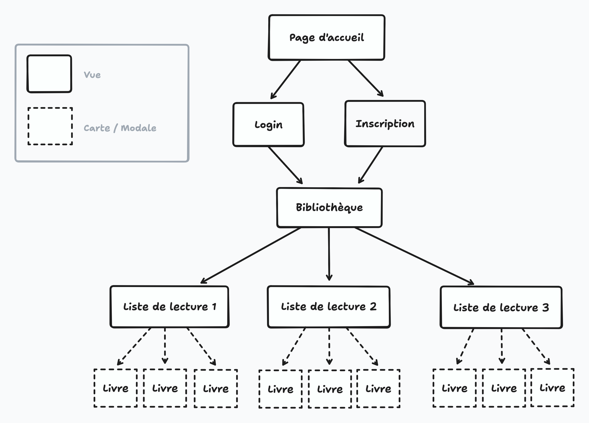
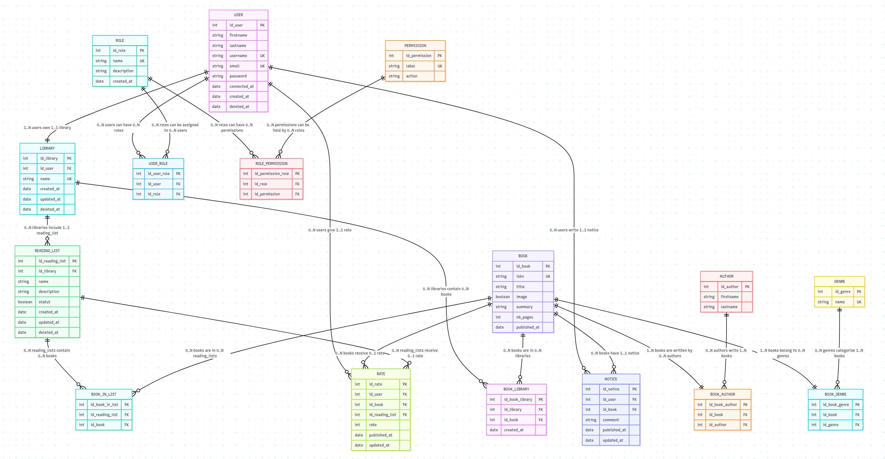
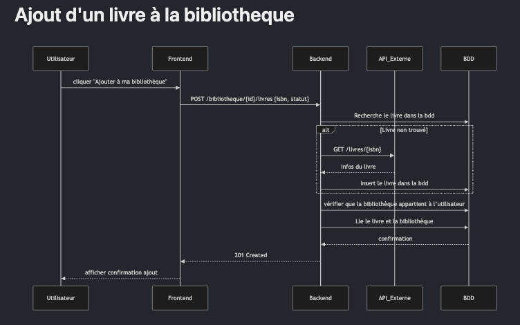
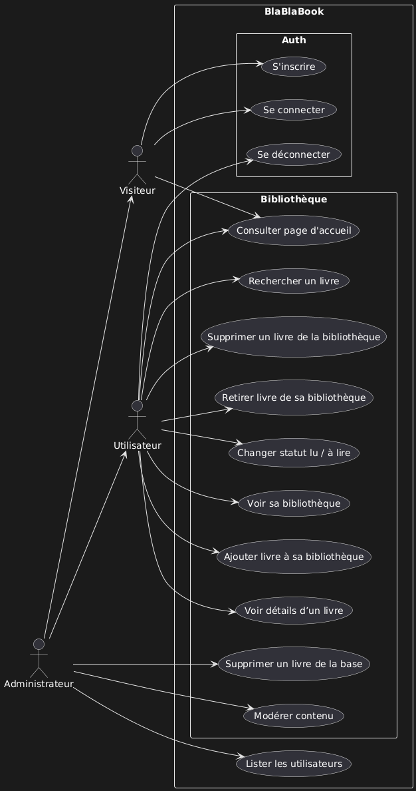

# <br><p align="center" p>Cahier des charges BlablaBook📚 <br>

# <br><p align="center" p>**SOMMAIRE**

- ## I. Présentation 👋

- ## II. Fonctionnalités du projet ⚙️

  - II-1. MVP (Minimum Viable Product)
    - Besoins Fonctionnels de l'application
  - Version 1.1 - Améliorations Rapides

- ## III. Évolutions potentielles ↗️

  - Version 1.2 - Fonctionnalités Sociales
    - Partage et communauté
    - Sécurité avancée
  - Version 1.3 - Intelligence Artificielle
    - Recommandations personnalisées
  - Version 2.0 - Extension Mobile
    - Application mobile native
  - Version 2.1+ - Fonctionnalités Avancées
    - Intégrations externes
    - Fonctionnalités premium

- ## IV. Choix et Justification de l'architecture du projet 🏗️

- ## V. Liste des Technologies utilisées pour le projet 🛠️

  - V-1. BackEnd
    - RunTime & Framework
    - Infrastructure & Déploiement
  - V-2. Base de Données
  - V-3. FrontEnd
    - Framework & Build

- ## VI. Authentification / Autorisation 👮

  - VI-1. Authentification ㊙️
  - VI-2. Validation & Sécurité 🔐
  - VI-3. Sécurité & Authentification 🔐 ㊙️
  - VI-4. Tests & Qualité 🧪

- ## VII. Cible 🎯

  - VII-1. Cible principale (utilisateurs visés)
  - VII-2. Navigateurs compatibles 🌐

- ## VIII. Arborescence de l'application 🌳

- ## IX. Liste des routes de l'application 🛣️

  - IX-1. Auth
  - IX-2. Gestion utilisateur
  - IX-3. Livres (Recherche)
  - IX-4. Bibliothèque personnelle
  - IX-5. Liste de lecture

- ## X. User Stories 👥

  - Rôle : Visiteur
  - Rôle : Utilisateur
  - Rôle : Administrateur

- ## XI. Analyse des Risques ⚠️

  - API et services externes
  - Base de données
  - Sécurité
  - Infrastructure

- ## XII. Rôle de l’équipe 🧑‍🤝‍🧑

- ## XIII. RGPD (Règlement Général sur la Protection des Données) ⚖️

  - Inventaire des données
  - Politique de confidentialité
  - Consentement
  - Droits des utilisateurs
  - Sécurité des données
  - Registre des traitements
  - Cookies / Traceurs
  - Sensibilisation de l’équipe

- ## XIV. Documents de Conception 📄

  - Diagramme ERD
  - Diagramme de Séquence
  - Use Case

## <br> I- Présentation 👋

**BlaBlaBook** est une plateforme web pensée pour tous les passionnés de lecture.
Elle permet aux utilisateurs de créer et gérer leur bibliothèque personnelle, suivre leurs lectures, découvrir de nouveaux ouvrages et partager leurs avis avec d’autres lecteurs.

L’objectif est de favoriser l’échange autour des livres, créer une communauté active et rendre la gestion de ses lectures simple et agréable.

Le projet a été réalisé en équipe, avec une organisation en méthode agile. Nous avons travaillé par étapes, de la conception au développement, en passant par des phases de test et de mise en ligne.

## Fonctionnalités du projet ⚙️

### MVP (Minimum Viable Product) ==> Besoins Fonctionnels de l'application

- Page d'accueil avec présentation de BlaBlaBook et quelques livres "random".
- Système d'inscription et de connexion. 🔐
- Gestion de bibliothèque personnelle : ajouter des livres, lus et à lire, pouvoir les retirer de sa liste (et non de la base de données ^^).
- Recherche et découverte de nouveaux livres : moteur de recherche. 🔎
- Page de détail d'un livre avec les informations liées à ce dernier.

## Evolutions potentielles↗️

### Version 1.1 - Améliorations Rapides

#### Amélioration de l'expérience utilisateur

- **Système de notation et d'avis** : Permettre aux utilisateurs de noter et commenter les livres pour partager leurs opinions et aider la communauté
- **Statistiques personnelles** : Affichage des habitudes de lecture (genres préférés, nombre de livres lus, progression annuelle)
- **Recherche avancée** : Filtrage des résultats par genre, note moyenne, date de publication et autres critères
- **Moteur de recherche dynamique** : Suggestions en temps réel dans une liste déroulante pour améliorer l'expérience de recherche

#### Fonctionnalités RGPD et conformité

- **Export de données** : Permettre aux utilisateurs de récupérer l'historique complet de leur bibliothèque et données personnelles
- **Droit à l'oubli** : Suppression complète et définitive du compte utilisateur et de toutes ses données associées
- **Mentions légales** : Mise en place des informations légales conformes au RGPD et aux réglementations en vigueur

#### Modération et administration

- **Modération des contenus** : Outils de gestion des avis et commentaires inappropriés par les administrateurs
- **Statistiques globales** : Tableau de bord administrateur avec métriques d'usage, livres populaires et analyses d'activité

---

### Version 1.2 - Fonctionnalités Sociales

#### Partage et communauté

- **Bibliothèques publiques** : Option permettant aux utilisateurs de rendre leur bibliothèque visible publiquement (entièrement ou partiellement)
- **Forum de discussion** : Création d'espaces d'échange thématiques dédiés aux discussions sur les livres et la lecture
- **Chat en temps réel** : Système de messagerie instantanée entre utilisateurs pour des échanges directs
- **Groupes de lecture** : Fonctionnalité de création et participation à des clubs de lecture thématiques ou par affinités

#### Sécurité avancée

- **Gestion des permissions** : Système de rôles avec différents niveaux d'accès administrateur
- **Configuration sécuritaire** : Interface de paramètres de sécurité avancés accessible aux administrateurs

---

### Version 1.3 - Intelligence Artificielle

#### Recommandations personnalisées

- **Algorithme de recommandation** : Système de suggestions de livres basé sur les genres préférés, les notes attribuées et l'historique de lecture
- **Support multilingue** : Extension de l'interface pour supporter au minimum le français et l'anglais

---

### Version 2.0 - Extension Mobile

#### Application mobile native

- **Scanner de livres** : Fonctionnalité d'ajout de livres par scan du code-barres via l'application mobile
- **Synchronisation cross-platform** : Continuité parfaite des données entre les versions web et mobile
- **Notifications push** : Système d'alertes pour nouveaux livres recommandés, activités des groupes et interactions sociales

---

### Version 2.1+ - Fonctionnalités Avancées

#### Intégrations externes

- **API partenaires** : Intégration avec d'autres plateformes de lecture et librairies en ligne
- **Synchronisation e-readers** : Connexion et synchronisation avec les liseuses populaires (Kindle, Kobo, etc.)
- **Réseaux sociaux** : Fonctionnalités de partage de lectures et recommandations sur les plateformes sociales externes

#### Fonctionnalités premium

- **Analyses avancées** : Génération de rapports détaillés de lecture, tendances personnalisées et comparaisons
- **Sauvegarde cloud** : Système de stockage sécurisé et redondant des données utilisateur
- **Thèmes personnalisés** : Options de personnalisation avancée de l'interface utilisateur

---

# Choix et Justification de l'architecture du projet🏗️

Nous avons opté pour une architecture client-serveur (ou architecture découplée) afin de séparer clairement les responsabilités entre le frontend et le backend, garantissant ainsi une meilleure maintenabilité et évolutivité du projet. Cette approche consiste en une API REST développée avec Node.js et Express, qui communique avec une Single Page Application (SPA) développée en React.

Le backend, orchestré avec Sequelize pour la gestion de la base de données PostgreSQL, expose des endpoints REST pour toutes les fonctionnalités métier : gestion des utilisateurs, bibliothèques personnelles, listes de lecture et avis. Le frontend React consomme cette API via des requêtes HTTP (Axios), offrant une interface utilisateur dynamique et réactive.

Cette séparation nous permet une plus grande flexibilité : le frontend peut évoluer indépendamment du backend, et l'API peut potentiellement servir d'autres clients (application mobile, autres interfaces). L'ensemble est orchestré via Docker pour assurer l'isolation des services et la portabilité entre environnements.

Pour les données livres, nous utilisons l'API Open Library comme source externe, le backend servant de passerelle pour filtrer et enrichir ces données avant de les exposer au frontend. Cette approche renforce la sécurité (pas d'appel direct depuis le client) et nous permet de ne stocker que les livres réellement utilisés par nos utilisateurs. Le backend garde ainsi le contrôle total sur les interactions personnalisées comme les statuts de lecture, les commentaires et la gestion des listes privées/publiques.

Cette architecture découplée offre un bon équilibre entre simplicité de développement pour un MVP et possibilités d'évolution futures.

## Liste des Technologies utilisées pour le projet

_(🟥 tout ne sera peut être pas utilisé)_

## BackEnd💻

#### RunTime & Framework

_Choix_

- **Node.js** : Environnement d'exécution JavaScript côté serveur
- **Express.js** : Framework web minimal et flexible
- **TypeScript** : Langage typé pour une meilleure robustesse

_Justification_

- **Écosystème mature** : Millions de packages NPM
- **Performance** : Event loop non-bloquant
- **Cohérence** : Même langage frontend/backend
- **Équipe** : Compétences JavaScript déjà acquises

#### Infrastructure & Déploiement

_Choix_

- **Docker** : Containerisation complète (obligatoire V1.0)
- **Nginx** : Reverse proxy et SSL termination (obligatoire V1.0)
- **Docker Compose** : Orchestration multi-conteneurs

_Justification_

-**Docker/ Docker Compose**:

- **Mise en production** : Contrainte projet, déploiement requis
- **Environnement uniforme** : Équipe de 4, standardisation obligatoire
- **Isolation** : PostgreSQL + Redis + App + Nginx séparés
- **Reproductibilité** : Builds identiques dev/prod
- **CI/CD** : Pipeline automatisé plus fiable

-**Nginx**:

- **SSL/HTTPS** : Sécurité production non négociable
- **Performance** : Cache statique et compression
- **Sécurité** : Rate limiting et proxy reverse
- **Monitoring** : Logs d'accès et métriques
- **Évolutivité** : Load balancing prêt si besoin

### Base de Donnéesℹ️

_Choix_

- **PostgreSQL** : SGBD relationnel avec support JSON natif (conteneur Docker)
- **Redis** : Cache et sessions haute performance (conteneur Docker)
- **Sequelize** : ORM pour Node.js avec protection anti-injection SQL

_Justification_ -**PostgreSQL**:

- **ACID complet** : Transactions sécurisées critiques
- **JSON natif** : Stockage métadonnées Google Books
- **Full-text search** : Recherche optimisée livres
- **Extensions** : UUID, crypto, indexation avancée
- **Gratuit** : Heroku, Railway, Supabase

-**Sequelize**:

- **Mature** : Écosystème établi, debugging facile
- **TypeScript** : Support natif excellent
- **Migrations** : Gestion schéma robuste
- **Documentation** : Très complète

## FrontEnd🌈

#### Framework & Build

- **React 18** : Bibliothèque UI avec hooks et concurrent features
- **Vite** : Build tool ultra-rapide avec HMR optimisé
- **TypeScript** : Cohérence avec backend, types automatiques

### Authentification/Autorisation👮

#### Authentification ㊙️

- **Argon2** : Algorithme de hachage sécurisé (inclus dans Better Auth)
- **Better Auth** : Solution d'authentification moderne TypeScript-first

#### Validation & Sécurité🔐

- **Zod** : Validation de schémas avec typage automatique
- **Helmet** : Headers de sécurité HTTP
- **CORS** : Gestion Cross-Origin Resource Sharing via Nginx
- **SSL/TLS** : HTTPS obligatoire en production via Nginx

#### Sécurité & Authentification🔐 ㊙️

- **OWASP Top 10 compliant** par défaut
- **TypeScript natif** avec types automatiques
- **Multi-provider** : Email/password + OAuth ready
- **CSRF intégré** : Protection automatique
- **Sessions sécurisées** : Gestion tokens et refresh
- **Rate limiting** : Protection brute force intégrée
- **Argon2** : Hachage moderne recommandé OWASP

#### Tests & Qualité 🧪

- **Jest** : Framework de tests unitaires et d'intégration
- **Supertest** : Tests spécialisés pour endpoints API
- **@faker-js/faker** : Génération de données de test réalistes
- **ESLint + Prettier** : Qualité et formatage du code

## Cible 🎯

### Cible principale (utilisateurs visés)

**Lecteurs occasionnels ou débutants :**

Besoins : Suivre facilement leurs lectures, découvrir des livres populaires ou adaptés à leurs goûts.
Intérêt : Interface simple, recommandations, organisation de leur bibliothèque sans complexité.

**Lecteurs réguliers et passionnés :**

Besoins : Gérer une collection plus large, retrouver des livres lus, donner leur avis.
Intérêt : Organisation précise, espace pour noter et commenter, découvrir d’autres passionnés.

**Communauté de lecteurs :**

Besoins : Partager, discuter, se recommander des lectures.
Intérêt : Plateforme sociale dédiée à la lecture, moins impersonnelle qu’Amazon ou Goodreads.

Médiateurs culturels (facultatif) :

Exemples : Professeurs, bibliothécaires, clubs de lecture.
Intérêt : Suivre des groupes de lecture, recommander des ouvrages à des élèves ou adhérents.

## Navigateurs compatibles 🌐

L'application BlaBlaBook sera compatible avec les navigateurs web modernes les plus récents. La liste précise des versions supportées sera affinée au fur et à mesure de l'avancement du projet, en fonction des technologies et fonctionnalités spécifiques qui seront implémentées.
Support prévu :

- Chrome 90+
- Firefox 88+
- Safari 14+
- Edge 90+

Note : Internet Explorer ne sera pas supporté, conformément aux standards actuels du développement web moderne.
Cette approche nous permet de nous concentrer sur les navigateurs représentant la majorité du trafic web actuel tout en bénéficiant des dernières fonctionnalités et standards web pour offrir une expérience utilisateur optimale.

## Arborescence de l'application 🌳



## Listes des routes de l'application 🛣️

| Méthode | Route                | Description             | Données attendues                                    |
| ------- | -------------------- | ----------------------- | ---------------------------------------------------- |
| POST    | `/api/auth/register` | Inscription utilisateur | `{ firstname, lastname, username, email, password }` |
| POST    | `/api/auth/login`    | Connexion utilisateur   | `{ email, password }` OU `{ username, password }`    |
| POST    | `/api/auth/logout`   | Déconnexion utilisateur | -                                                    |

### Gestion utilisateur

| Méthode | Route               | Description         | Données attendues                              |
| ------- | ------------------- | ------------------- | ---------------------------------------------- |
| GET     | `/api/user/profile` | Récupérer le profil | -                                              |
| PUT     | `/api/user/profile` | Modifier le profil  | `{ firstname?, lastname?, username?, email? }` |
| DELETE  | `/api/user/account` | Supprimer le compte | -                                              |

### Livres (Recherche)

| Méthode | Route               | Description           | Données attendues                     |
| ------- | ------------------- | --------------------- | ------------------------------------- |
| GET     | `/api/books/search` | Rechercher des livres | Query: `q` (terme), `limit?` (nombre) |
| GET     | `/api/books/:id`    | Détails d'un livre    | Param: `id` (ID livre)                |

### Bibliothèque personnelle

| Méthode | Route                  | Description               | Données attendues                                                 |
| ------- | ---------------------- | ------------------------- | ----------------------------------------------------------------- |
| GET     | `/api/library`         | Récupérer sa bibliothèque | Query: `name?` (nom bibliothèque)                                 |
| POST    | `/api/library`         | Ajouter un livre          | `{ id_book, name? }` (name pour créer bibliothèque si nécessaire) |
| DELETE  | `/api/library/:bookId` | Retirer un livre          | Param: `bookId`                                                   |

### Liste de lecture

| Méthode | Route                                  | Description            | Données attendues                                |
| ------- | -------------------------------------- | ---------------------- | ------------------------------------------------ |
| GET     | `/api/reading-lists`                   | Récupérer ses listes   | Query: `statut?` (true/false pour actif/inactif) |
| POST    | `/api/reading-lists`                   | Créer une liste        | `{ name, description?, statut?, id_library }`    |
| GET     | `/api/reading-lists/:id`               | Détails d'une liste    | Param: `id`                                      |
| PUT     | `/api/reading-lists/:id`               | Modifier une liste     | `{ name?, description?, statut? }`               |
| DELETE  | `/api/reading-lists/:id`               | Supprimer une liste    | Param: `id`                                      |
| POST    | `/api/reading-lists/:id/books`         | Ajouter livre à liste  | Param: `id`, Body: `{ id_book }`                 |
| DELETE  | `/api/reading-lists/:id/books/:bookId` | Retirer livre de liste | Params: `id`, `bookId`                           |

### Avis et notes

| Méthode | Route                    | Description               | Données attendues                               |
| ------- | ------------------------ | ------------------------- | ----------------------------------------------- |
| GET     | `/api/books/:id/notices` | Récupérer avis d'un livre | Param: `id` (ID livre)                          |
| POST    | `/api/books/:id/notices` | Créer un avis             | Param: `id`, Body: `{ comment }`                |
| PUT     | `/api/notices/:id`       | Modifier son avis         | Param: `id`, Body: `{ comment }`                |
| DELETE  | `/api/notices/:id`       | Supprimer son avis        | Param: `id`                                     |
| POST    | `/api/books/:id/rate`    | Noter un livre            | Param: `id`, Body: `{ rate, id_reading_list? }` |
| PUT     | `/api/rates/:id`         | Modifier sa note          | Param: `id`, Body: `{ rate }`                   |
| DELETE  | `/api/rates/:id`         | Supprimer sa note         | Param: `id`                                     |

### Gestion des auteurs/genres (Admin)

| Méthode | Route          | Description       | Données attendues                  |
| ------- | -------------- | ----------------- | ---------------------------------- |
| GET     | `/api/authors` | Liste des auteurs | Query: `search?` (terme recherche) |
| POST    | `/api/authors` | Créer un auteur   | `{ firstname?, lastname }`         |
| GET     | `/api/genres`  | Liste des genres  | -                                  |
| POST    | `/api/genres`  | Créer un genre    | `{ name }`                         |

### Légende

- `?` = Optionnel
- `Query` = Paramètres URL (?param=value)
- `Param` = Paramètres de route (/api/route/:param)
- `Body` = Données dans le corps de la requête
- `rate` = Entier de 1 à 5
- `statut` = Boolean (true=actif, false=inactif)

# UserStories 👥

#### Rôles Utilisateurs

- **Visiteur** : Utilisateur non connecté découvrant l'application
- **Utilisateur** : Utilisateur connecté gérant sa bibliothèque personnelle
- **Administrateur** : Rôle de modération et gestion globale

## 👥 Rôle : Visiteur (non connecté)

### 🚀 V1.0 (MVP) - Fonctionnalités Essentielles

| En tant que                      | Je souhaite que                                                                                     | Afin de                                                                      |
| -------------------------------- | --------------------------------------------------------------------------------------------------- | ---------------------------------------------------------------------------- |
| **US-V01**: En tant que visiteur | je veux voir une page d'accueil présentant BlaBlaBook et quelques livres aléatoires                 | afin de découvrir rapidement l'application et m'inciter à m'inscrire         |
| **US-V02**: En tant que visiteur | je veux m'inscrire avec un email et un mot de passe                                                 | afin de créer un compte sécurisé et accéder aux fonctionnalités personnelles |
| **US-V03**: En tant que visiteur | je veux me connecter avec mes identifiants                                                          | afin d'accéder à mon compte existant                                         |
| **US-V04**: En tant que visiteur | je veux rechercher des livres via un moteur de recherche                                            | afin de découvrir de nouveaux titres sans inscription                        |
| **US-V05**: En tant que visiteur | je veux accéder à une page de détail d'un livre avec ses informations (titre, auteur, résumé, etc.) | afin d'en savoir plus sur un livre                                           |

### 🌱 V1.1 - Améliorations Rapides

| En tant que                      | Je souhaite que                                                                       | Afin de                                                                      |
| -------------------------------- | ------------------------------------------------------------------------------------- | ---------------------------------------------------------------------------- | -------------------------------------------------------- |
| **US-V06**: En tant que visiteur | je veux filtrer les résultats de recherche par genre, note, date de publication, etc. | afin de trouver plus précisément des livres qui m'intéressent                |
| **US-V07**:                      | En tant que visiteur                                                                  | je veux voir des résultats de recherche dynamiques dans une liste déroulante | afin d'améliorer l'expérience de recherche en temps réel |
| **US-V08**: En tant que visiteur | je veux consulter les mentions légales et la politique RGPD                           | afin de connaître mes droits concernant mes données personnelles             |

### 🌍 V1.3 - Fonctionnalités Avancées (Algorithmiques)

| **US-V09**: En tant que | Je souhaite que                                                                       | Afin de                                           |
| ----------------------- | ------------------------------------------------------------------------------------- | ------------------------------------------------- |
| En tant que visiteur    | je veux basculer l'application entre plusieurs langues (au moins français et anglais) | afin d'accéder au contenu dans ma langue préférée |

## 👥 Rôle : Utilisateurs

### 🚀 V1.0 (MVP) - Fonctionnalités Essentielles

| En tant que                                 | Je souhaite que                                                                            | Afin de                                         |
| ------------------------------------------- | ------------------------------------------------------------------------------------------ | ----------------------------------------------- |
| **US-U01**: En tant qu'utilisateur connecté | je veux accéder à ma bibliothèque personnelle                                              | afin de voir mes livres organisés (lus/à lire). |
| **US-U02**: En tant qu'utilisateur connecté | je veux ajouter un livre à ma liste de livres lus ou à lire                                | afin de gérer ma bibliothèque personnelle..     |
| **US-U03**: En tant qu'utilisateur connecté | je veux retirer un livre de ma liste personnelle (sans le supprimer de la base de données) | afin de mettre à jour ma bibliothèque.          |
| **US-U04**: En tant qu'utilisateur connecté | je veux me déconnecter de manière sécurisée                                                | afin de protéger mes données personnelles.      |
| **US-U05**: En tant qu'utilisateur connecté | je veux modifier mes informations de profil                                                | afin de maintenir mes données à jour.           |

### 🌱 V1.1 - Améliorations Rapides

| En tant que                                 | Je souhaite que                                                                                      | Afin de                                                        |
| ------------------------------------------- | ---------------------------------------------------------------------------------------------------- | -------------------------------------------------------------- |
| **US-U06**: En tant qu'utilisateur connecté | je veux laisser une note et un avis sur un livre                                                     | afin de partager mon opinion et aider les autres utilisateurs. |
| **US-U07**: En tant qu'utilisateur connecté | je veux consulter des statistiques sur ma bibliothèque (nombre de livres lus, genres préférés, etc.) | afin d'analyser mes habitudes de lecture                       |
| **US-U08**: En tant qu'utilisateur connecté | je veux récupérer l'historique de ma bibliothèque et mes données personnelles                        | afin de garder une sauvegarde ou changer de service.           |
| **US-U09**: En tant qu'utilisateur connecté | je veux supprimer mon compte et toutes mes données                                                   | afin d'exercer mon droit à l'oubli.                            |

### 👥 V1.2 - Fonctionnalités Sociales

| En tant que                                 | Je souhaite que                                                        | Afin de                                                     |
| ------------------------------------------- | ---------------------------------------------------------------------- | ----------------------------------------------------------- |
| **US-U10**: En tant qu'utilisateur connecté | je veux rendre ma bibliothèque publique (entièrement ou partiellement) | afin de partager mes lectures avec d'autres.                |
| **US-U11**: En tant qu'utilisateur connecté | je veux participer à un forum de discussion sur les livres             | afin d'échanger des idées avec la communauté.               |
| **US-U12**: En tant qu'utilisateur connecté | je veux discuter en chat direct avec d'autres utilisateurs             | afin d'avoir des interactions en temps réel sur des livres. |
| **US-U13**: En tant qu'utilisateur connecté | je veux créer ou rejoindre des groupes de lecture thématiques          | afin de partager des expériences collectives.               |

### 🤖 V1.3 - Fonctionnalités Avancées (Algorithmiques)
| En tant que | Je souhaite que | Afin de |
| -------------------- | ------------------------------------------------------------------------------------- | ------------------------------------------------- |
|**US-U14**: En tant qu'utilisateur connecté | je veux recevoir des recommandations simples de livres (basées sur mes genres préférés et notes) | afin de découvrir de nouveaux livres susceptibles de m'intéresser.|

### 📱 V2.0 - Extension Mobile

| En tant que                                 | Je souhaite que                                   | Afin de                                        |
| ------------------------------------------- | ------------------------------------------------- | ---------------------------------------------- |
| **US-U15**: En tant qu'utilisateur connecté | je veux scanner un livre via l'application mobile | afin de l'ajouter facilement à ma bibliothèque |

## 👥 Rôle : Administrateur

### 🚀 V1.0 (MVP) - Fonctionnalités Essentielles

| En tant que                           | Je souhaite que                                                                                  | Afin de                                                             |
| ------------------------------------- | ------------------------------------------------------------------------------------------------ | ------------------------------------------------------------------- |
| **US-A01**: En tant qu'administrateur | je veux me connecter avec des identifiants spécifiques et des permissions élevées                | afin de gérer la plateforme de manière sécurisée.                   |
| **US-A02**: En tant qu'administrateur | je veux ajouter ou supprimer des livres de la base de données globale                            | afin de maintenir un catalogue à jour et précis.                    |
| **US-A03**: En tant qu'administrateur | je veux gérer les comptes utilisateurs (suspendre ou supprimer en cas d'abus)                    | afin d'assurer la sécurité de la plateforme.                        |
| **US-A04**: En tant qu'administrateur | je veux que l'application respecte les standards de sécurité OWASP Top 10                        | afin de protéger la plateforme contre les vulnérabilités critiques. |
| **US-A05**: En tant qu'administrateur | je veux surveiller et logger les tentatives d'accès suspects, puis consulter ces logs d'activité | afin de détecter, analyser et prévenir les attaques.                |
| **US-A06**: En tant qu'administrateur | je veux gérer les demandes RGPD des utilisateurs (export/suppression de données)                 | afin de respecter la réglementation.                                |

### 🌱 V1.1 - Améliorations Rapides

| En tant que                           | Je souhaite que                                                                                                        | Afin de                                                                |
| ------------------------------------- | ---------------------------------------------------------------------------------------------------------------------- | ---------------------------------------------------------------------- |
| **US-A07**: En tant qu'administrateur | je veux modérer les avis et commentaires des utilisateurs (supprimer ou éditer)                                        | afin de maintenir un environnement respectueux et conforme aux règles. |
| **US-A08**: En tant qu'administrateur | je veux accéder à des statistiques globales de la plateforme (nombre d'utilisateurs, livres les plus populaires, etc.) | afin d'analyser l'usage et proposer des améliorations.                 |

### 🔒 V1.2 - Sécurité Avancée

| En tant que                            | Je souhaite que                                                  | Afin de                                                   |
| -------------------------------------- | ---------------------------------------------------------------- | --------------------------------------------------------- |
| **US-A09**: En tant qu'administrateur  | je veux configurer les paramètres de sécurité de l'application   | afin de protéger la plateforme contre les vulnérabilités. |
| **US-A010**: En tant qu'administrateur | je veux créer et gérer différents niveaux d'accès administrateur | afin d'organiser la gestion de l'équipe                   |

## Analyses des Risques

### API et services externes

| Risque                        | Probabilité | Impact | Mitigation                                 |
| ----------------------------- | ----------- | ------ | ------------------------------------------ |
| API Google Books indisponible | Faible      | Fort   | Cache local + message d'erreur utilisateur |
| Quotas API dépassés           | Moyenne     | Moyen  | Cache local + limite de requêtes           |

### Base de données

| Risque                   | Probabilité | Impact | Mitigation                                     |
| ------------------------ | ----------- | ------ | ---------------------------------------------- |
| Perte de données         | Faible      | Fort   | Sauvegardes régulières + environnement de test |
| Problèmes de performance | Moyenne     | Moyen  | Index + pagination                             |

### Sécurité

| Risque                     | Probabilité | Impact | Mitigation                                           |
| -------------------------- | ----------- | ------ | ---------------------------------------------------- |
| Failles d'authentification | Moyenne     | Fort   | Hachage argon2 + Better Auth + validation des inputs |
| Injection SQL              | Faible      | Fort   | ORM Sequelize + validation données                   |

### Infrastructure

| Risque                         | Probabilité | Impact | Mitigation                                 |
| ------------------------------ | ----------- | ------ | ------------------------------------------ |
| Problèmes de déploiement       | Moyenne     | Moyen  | Docker + Documentation                     |
| Environnement de développement | Forte       | Faible | Docker Compose + variables d'environnement |

## Rôle de l'équipe 🧑‍🤝‍🧑🧑‍🤝‍🧑

L'équipe est composée de 4 développeurs concepteurs.

- Lucas: LeadDev / Développeur Front-End
- Elodie: Scrum Master / Développeur Front-End
- Jonathan: Designer / Développeur Back-End
- Stéphane: DevOps/ Développeur Back-End

## RGPD (Réglement Général sur la protection des données) ⚠️

## **1**. Inventorier les données personnelles collectées:

- Liste toutes les données collectées : nom, prénom, email, mot de passe, listes de livres, avis, adresse IP, cookies, etc. Ne collecte que ce qui est nécessaire au fonctionnement de la plateforme (principe de minimisation).

## **2**.Afficher une politique de confidentialité:

- Publier une politique de confidentialité claire, accessible depuis toujours (ex : pied de page). Elle doit expliquer :

- Qui est responsable du traitement des données

- Les finalités des traitements (inscription, gestion bibliothèque, avis, etc.)

- Les bases légales (ex : exécution du contrat ou consentement)

- Les droits utilisateurs (accès, rectification, suppression, limitation, opposition, portabilité)

- La durée de conservation de chaque type de donnée

- À qui les données sont transmises le cas échéant.

## **3**. Consentement explicite là où nécessaire:

- Ajoute des cases à cocher pour le consentement lors de l’inscription ou de l’ajout d’options (ex : recevoir une newsletter).

- _Cookie banner_: informe clairement sur la présence de cookies et leur utilisation, et permets un choix granulaire (nécessaires, statistiques, marketing…).

## **4.** Faciliter l’exercice des droits des personnes.

Permet aux utilisateurs de :

- Accéder à leurs données (section "mon compte")
- Les modifier, les supprimer ou demander leur suppression
- Récupérer leurs données (droit à la portabilité)
- Retirer leur consentement aussi facilement qu’ils l’ont donné.

## **5.** Sécurité des données

- Utilise le chiffrement (https pour le site, mots de passe hashés)
- Limite l’accès aux données aux seules personnes nécessaires
- Mets en place des sauvegardes et procédures en cas de violation (notifier toute fuite sous 72h à la CNIL et aux utilisateurs concernés)
- Documente les mesures de sécurité et conserve un registre des traitements.

## **6.** Registre des traitements

Même pour une petite application, maintiens un registre des traitements : chaque traitement (ex : création de compte, gestion des listes…), les données concernées, la finalité, durée de conservation, éventuels sous-traitants, mesures de sécurité, etc..

## **7.** Information & gestion des cookies/traceurs

Informer sur l’utilisation de cookies ou traceurs et permettre le refus sauf ceux strictement nécessaires.

Mettre en place un gestionnaire de cookies conforme (bandeau, consentement granulaire…).

## **8.** Sensibiliser l’équipe (si elle existe)

Toute personne ayant accès aux données doit être sensibilisée à la protection de la vie privée et à la sécurité.

**RGPD et Mentions Légales :** mettre en place les mentions légales liées au règlement général sur la protection des données (RGPD).

```
  ** Au RGPD : articles 5.2 (responsabilité), 25 (privacy by design) et 33 (notification des violations)
  ** À la loi française "Informatique et Libertés" modifiée (loi n°78-17 du 6 janvier 1978) : articles 82 à 84 sur la sécurité des données
  ** Au Code pénal français : articles 323-1 à 323-7 sur les atteintes aux systèmes de traitement automatisé de données
```

# Documents de Conception

## <p align="center" p> Diagramme ERD (entité relationnel de données)



## <p align="center" p> Diagramme de Séquence



## <p align="center" p> Use Case



## <p align="center" p> Diagramme d'Activité


## Dictionnaire de données

### 0. Contexte technique

Ce dictionnaire des données a été conçu pour une utilisation avec l'ORM **Sequelize** (Node.js). Les types de données et contraintes sont optimisés pour cette technologie :

- **Types simplifiés** : Privilégiation de TEXT sur VARCHAR pour la flexibilité
- **Contraintes ORM** : Validation côté application plutôt que base de données
- **Dates** : Type DATE géré automatiquement par Sequelize (timestamps inclus)
- **JSON natif** : Support des colonnes JSON pour les données complexes

---

### 1. Vue d'ensemble

#### 1.1 Entités du système

| Code         | Libellé          | Description                                 |
| ------------ | ---------------- | ------------------------------------------- |
| USER         | Utilisateur      | Comptes utilisateurs de l'application       |
| ROLE         | Rôle             | Rôles du système RBAC                       |
| PERMISSION   | Permission       | Permissions du système RBAC                 |
| BOOK         | Livre            | Informations sur les livres                 |
| LIBRARY      | Bibliothèque     | Bibliothèques personnelles des utilisateurs |
| READING_LIST | Liste de lecture | Collections thématiques de livres           |
| NOTICE       | Avis             | Avis/critiques sur les livres               |
| RATE         | Note             | Notes numériques attribuées aux livres      |
| AUTHOR       | Auteur           | Informations sur les auteurs de livres      |
| GENRE        | Genre            | Genres littéraires                          |

#### 1.2 Tables de relations

| Code            | Libellé            | Entité 1 | Entité 2     | Description                            |
| --------------- | ------------------ | -------- | ------------ | -------------------------------------- |
| USER_ROLE       | Utilisateur-Rôle   | USER     | ROLE         | Attribution des rôles aux utilisateurs |
| ROLE_PERMISSION | Rôle-Permission    | ROLE     | PERMISSION   | Attribution des permissions aux rôles  |
| BOOK_LIBRARY    | Livre-Bibliothèque | BOOK     | LIBRARY      | Livres dans les bibliothèques          |
| BOOK_IN_LIST    | Livre-Liste        | BOOK     | READING_LIST | Livres dans les listes de lecture      |
| BOOK_AUTHOR     | Livre-Auteur       | BOOK     | AUTHOR       | Auteurs des livres                     |
| BOOK_GENRE      | Livre-Genre        | BOOK     | GENRE        | Genres des livres                      |

---

### 2. Description des entités

#### USER

| Code         | Libellé           | Type    | Taille | Contraintes                    | Commentaire                       |
| ------------ | ----------------- | ------- | ------ | ------------------------------ | --------------------------------- |
| id_user      | ID utilisateur    | INTEGER | -      | PK, AUTO_INCREMENT, NOT NULL   | Clé primaire                      |
| firstname    | Prénom            | TEXT    | -      | NOT NULL                       | Prénom de l'utilisateur           |
| lastname     | Nom               | TEXT    | -      | NOT NULL                       | Nom de famille                    |
| username     | Nom d'utilisateur | TEXT    | -      | UNIQUE, NOT NULL               | Identifiant unique                |
| email        | Email             | TEXT    | -      | UNIQUE, NOT NULL               | Adresse email                     |
| password     | Mot de passe      | TEXT    | -      | NOT NULL                       | Hash du mot de passe              |
| connected_at | Date connexion    | DATE    | -      | NOT NULL, DEFAULT CURRENT_DATE | Dernière connexion                |
| created_at   | Date création     | DATE    | -      | NOT NULL, DEFAULT CURRENT_DATE | Date de création                  |
| deleted_at   | Date suppression  | DATE    | -      | NULL                           | Date de suppression (soft delete) |

**Domaines de valeurs :**

- username : Identifiant unique de l'utilisateur
- email : Adresse email valide
- password : Hash argon2 ou similaire

#### ROLE

| Code        | Libellé       | Type    | Taille | Contraintes                    | Commentaire         |
| ----------- | ------------- | ------- | ------ | ------------------------------ | ------------------- |
| id_role     | ID rôle       | INTEGER | -      | PK, AUTO_INCREMENT, NOT NULL   | Clé primaire        |
| name        | Nom           | TEXT    | -      | UNIQUE, NOT NULL               | Nom du rôle         |
| description | Description   | TEXT    | -      | NOT NULL                       | Description du rôle |
| created_at  | Date création | DATE    | -      | NOT NULL, DEFAULT CURRENT_DATE | Date de création    |

**Domaines de valeurs :**

- name : USER, MODERATOR, ADMIN

#### PERMISSION

| Code          | Libellé       | Type    | Taille | Contraintes                  | Commentaire                  |
| ------------- | ------------- | ------- | ------ | ---------------------------- | ---------------------------- |
| id_permission | ID permission | INTEGER | -      | PK, AUTO_INCREMENT, NOT NULL | Clé primaire                 |
| label         | Libellé       | TEXT    | -      | UNIQUE, NOT NULL             | Nom de la permission         |
| action        | Action        | TEXT    | -      | NULL                         | Description de la permission |

**Domaines de valeurs :**

- label : CREATE, READ, UPDATE, DELETE, MODERATE

#### BOOK

| Code         | Libellé          | Type    | Taille | Contraintes                  | Commentaire                    |
| ------------ | ---------------- | ------- | ------ | ---------------------------- | ------------------------------ |
| id_book      | ID livre         | INTEGER | -      | PK, AUTO_INCREMENT, NOT NULL | Clé primaire                   |
| isbn         | Code ISBN        | TEXT    | -      | UNIQUE, NULL                 | Code ISBN du livre             |
| title        | Titre            | TEXT    | -      | NOT NULL                     | Titre du livre                 |
| image        | Image disponible | BOOLEAN | -      | NOT NULL, DEFAULT FALSE      | Indicateur de présence d'image |
| summary      | Résumé           | TEXT    | -      | NULL                         | Résumé du livre                |
| nb_pages     | Nombre de pages  | INTEGER | -      | NULL                         | Nombre de pages                |
| published_at | Date publication | DATE    | -      | NULL                         | Date de publication            |

**Domaines de valeurs :**

- isbn : Code ISBN-10 ou ISBN-13 (optionnel)
- title : Titre complet du livre
- nb_pages : Nombre entier positif

#### LIBRARY

| Code       | Libellé           | Type    | Taille | Contraintes                    | Commentaire            |
| ---------- | ----------------- | ------- | ------ | ------------------------------ | ---------------------- |
| id_library | ID bibliothèque   | INTEGER | -      | PK, AUTO_INCREMENT, NOT NULL   | Clé primaire           |
| id_user    | ID utilisateur    | INTEGER | -      | FK, NOT NULL                   | Référence USER         |
| name       | Nom               | TEXT    | -      | UNIQUE, NOT NULL               | Nom de la bibliothèque |
| created_at | Date création     | DATE    | -      | NOT NULL, DEFAULT CURRENT_DATE | Date de création       |
| updated_at | Date modification | DATE    | -      | NOT NULL, DEFAULT CURRENT_DATE | Date de modification   |
| deleted_at | Date suppression  | DATE    | -      | NULL                           | Date de suppression    |

**Domaines de valeurs :**

- name : Nom personnalisé de la bibliothèque

#### READING_LIST

| Code            | Libellé           | Type    | Taille | Contraintes                    | Commentaire             |
| --------------- | ----------------- | ------- | ------ | ------------------------------ | ----------------------- |
| id_reading_list | ID liste          | INTEGER | -      | PK, AUTO_INCREMENT, NOT NULL   | Clé primaire            |
| id_library      | ID bibliothèque   | INTEGER | -      | FK, NOT NULL                   | Référence LIBRARY       |
| name            | Nom               | TEXT    | -      | NOT NULL                       | Nom de la liste         |
| description     | Description       | TEXT    | -      | NULL                           | Description de la liste |
| statut          | Statut            | BOOLEAN | -      | NOT NULL                       | Statut actif/inactif    |
| created_at      | Date création     | DATE    | -      | NOT NULL, DEFAULT CURRENT_DATE | Date de création        |
| updated_at      | Date modification | DATE    | -      | NOT NULL, DEFAULT CURRENT_DATE | Date de modification    |
| deleted_at      | Date suppression  | DATE    | -      | NULL                           | Date de suppression     |

**Domaines de valeurs :**

- statut : true (active), false (inactive)

#### NOTICE

| Code         | Libellé           | Type    | Taille | Contraintes                    | Commentaire          |
| ------------ | ----------------- | ------- | ------ | ------------------------------ | -------------------- |
| id_notice    | ID avis           | INTEGER | -      | PK, AUTO_INCREMENT, NOT NULL   | Clé primaire         |
| id_user      | ID utilisateur    | INTEGER | -      | FK, NOT NULL                   | Référence USER       |
| id_book      | ID livre          | INTEGER | -      | FK, NOT NULL                   | Référence BOOK       |
| comment      | Commentaire       | TEXT    | -      | NOT NULL                       | Texte de l'avis      |
| published_at | Date publication  | DATE    | -      | NOT NULL, DEFAULT CURRENT_DATE | Date de publication  |
| updated_at   | Date modification | DATE    | -      | NULL                           | Date de modification |

**Domaines de valeurs :**

- comment : Texte libre de l'avis utilisateur

#### RATE

| Code            | Libellé           | Type    | Taille | Contraintes                               | Commentaire            |
| --------------- | ----------------- | ------- | ------ | ----------------------------------------- | ---------------------- |
| id_rate         | ID note           | INTEGER | -      | PK, AUTO_INCREMENT, NOT NULL              | Clé primaire           |
| id_user         | ID utilisateur    | INTEGER | -      | FK, NOT NULL                              | Référence USER         |
| id_book         | ID livre          | INTEGER | -      | FK, NOT NULL                              | Référence BOOK         |
| id_reading_list | ID liste          | INTEGER | -      | FK, NULL                                  | Référence READING_LIST |
| rate            | Note              | INTEGER | -      | NOT NULL, CHECK (rate >= 1 AND rate <= 5) | Note de 1 à 5          |
| published_at    | Date publication  | DATE    | -      | NOT NULL, DEFAULT CURRENT_DATE            | Date de publication    |
| updated_at      | Date modification | DATE    | -      | NULL                                      | Date de modification   |

**Domaines de valeurs :**

- rate : Entier de 1 à 5 étoiles

#### AUTHOR

| Code      | Libellé   | Type    | Taille | Contraintes                  | Commentaire        |
| --------- | --------- | ------- | ------ | ---------------------------- | ------------------ |
| id_author | ID auteur | INTEGER | -      | PK, AUTO_INCREMENT, NOT NULL | Clé primaire       |
| firstname | Prénom    | TEXT    | -      | NULL                         | Prénom de l'auteur |
| lastname  | Nom       | TEXT    | -      | NOT NULL                     | Nom de famille     |

**Domaines de valeurs :**

- firstname : Prénom de l'auteur (optionnel)
- lastname : Nom de famille de l'auteur (obligatoire)

#### GENRE

| Code     | Libellé  | Type    | Taille | Contraintes                  | Commentaire  |
| -------- | -------- | ------- | ------ | ---------------------------- | ------------ |
| id_genre | ID genre | INTEGER | -      | PK, AUTO_INCREMENT, NOT NULL | Clé primaire |
| name     | Nom      | TEXT    | -      | UNIQUE, NOT NULL             | Nom du genre |

**Domaines de valeurs :**

- name : Fiction, Non-fiction, Science-fiction, Romance, Thriller, Fantasy, etc.

---

### 3. Tables de relations

#### USER_ROLE (Utilisateur - Rôle)

| Code         | Libellé        | Type    | Taille | Contraintes                  | Commentaire    |
| ------------ | -------------- | ------- | ------ | ---------------------------- | -------------- |
| id_user_role | ID relation    | INTEGER | -      | PK, AUTO_INCREMENT, NOT NULL | Clé primaire   |
| id_user      | ID utilisateur | INTEGER | -      | FK, NOT NULL                 | Référence USER |
| id_role      | ID rôle        | INTEGER | -      | FK, NOT NULL                 | Référence ROLE |

#### ROLE_PERMISSION (Rôle - Permission)

| Code               | Libellé       | Type    | Taille | Contraintes                  | Commentaire          |
| ------------------ | ------------- | ------- | ------ | ---------------------------- | -------------------- |
| id_permission_role | ID relation   | INTEGER | -      | PK, AUTO_INCREMENT, NOT NULL | Clé primaire         |
| id_role            | ID rôle       | INTEGER | -      | FK, NOT NULL                 | Référence ROLE       |
| id_permission      | ID permission | INTEGER | -      | FK, NOT NULL                 | Référence PERMISSION |

#### BOOK_LIBRARY (Livre - Bibliothèque)

| Code            | Libellé         | Type    | Taille | Contraintes                    | Commentaire       |
| --------------- | --------------- | ------- | ------ | ------------------------------ | ----------------- |
| id_book_library | ID relation     | INTEGER | -      | PK, AUTO_INCREMENT, NOT NULL   | Clé primaire      |
| id_library      | ID bibliothèque | INTEGER | -      | FK, NOT NULL                   | Référence LIBRARY |
| id_book         | ID livre        | INTEGER | -      | FK, NOT NULL                   | Référence BOOK    |
| created_at      | Date ajout      | DATE    | -      | NOT NULL, DEFAULT CURRENT_DATE | Date d'ajout      |

#### BOOK_IN_LIST (Livre - Liste de lecture)

| Code            | Libellé     | Type    | Taille | Contraintes                  | Commentaire            |
| --------------- | ----------- | ------- | ------ | ---------------------------- | ---------------------- |
| id_book_in_list | ID relation | INTEGER | -      | PK, AUTO_INCREMENT, NOT NULL | Clé primaire           |
| id_reading_list | ID liste    | INTEGER | -      | FK, NOT NULL                 | Référence READING_LIST |
| id_book         | ID livre    | INTEGER | -      | FK, NOT NULL                 | Référence BOOK         |

#### BOOK_AUTHOR (Livre - Auteur)

| Code           | Libellé     | Type    | Taille | Contraintes                  | Commentaire      |
| -------------- | ----------- | ------- | ------ | ---------------------------- | ---------------- |
| id_book_author | ID relation | INTEGER | -      | PK, AUTO_INCREMENT, NOT NULL | Clé primaire     |
| id_book        | ID livre    | INTEGER | -      | FK, NOT NULL                 | Référence BOOK   |
| id_author      | ID auteur   | INTEGER | -      | FK, NOT NULL                 | Référence AUTHOR |

#### BOOK_GENRE (Livre - Genre)

| Code          | Libellé     | Type    | Taille | Contraintes                  | Commentaire     |
| ------------- | ----------- | ------- | ------ | ---------------------------- | --------------- |
| id_book_genre | ID relation | INTEGER | -      | PK, AUTO_INCREMENT, NOT NULL | Clé primaire    |
| id_book       | ID livre    | INTEGER | -      | FK, NOT NULL                 | Référence BOOK  |
| id_genre      | ID genre    | INTEGER | -      | FK, NOT NULL                 | Référence GENRE |

---

### 4. Contraintes d'intégrité

#### 4.1 Contraintes référentielles

**Clés étrangères principales :**

- LIBRARY.id_user → USER.id_user (CASCADE DELETE)
- READING_LIST.id_library → LIBRARY.id_library (CASCADE DELETE)
- NOTICE.id_user → USER.id_user (CASCADE DELETE)
- NOTICE.id_book → BOOK.id_book (RESTRICT DELETE)
- RATE.id_user → USER.id_user (CASCADE DELETE)
- RATE.id_book → BOOK.id_book (RESTRICT DELETE)

#### 4.2 Contraintes fonctionnelles

**Contraintes d'unicité :**

- **UK_USER_USERNAME** : UNIQUE(username)

  - _Un nom d'utilisateur unique dans le système_

- **UK_USER_EMAIL** : UNIQUE(email)

  - _Un email unique par utilisateur_

- **UK_ROLE_NAME** : UNIQUE(name)

  - _Un nom de rôle unique_

- **UK_PERMISSION_LABEL** : UNIQUE(label)

  - _Un libellé de permission unique_

- **UK_BOOK_ISBN** : UNIQUE(isbn)

  - _Un code ISBN unique par livre_

- **UK_LIBRARY_NAME** : UNIQUE(name)

  - _Un nom de bibliothèque unique_

- **UK_GENRE_NAME** : UNIQUE(name)
  - _Un nom de genre unique_

**Contraintes de validation :**

- **CK_RATE_VALUE** : CHECK (rate >= 1 AND rate <= 5)

  - _La note doit être comprise entre 1 et 5_

- **CK_BOOK_PAGES** : CHECK (nb_pages > 0)
  - _Le nombre de pages doit être positif_

#### 4.3 Implémentation Sequelize

```javascript
// Exemple pour la table RATE
const Rate = sequelize.define('Rate', {
  id_rate: {
    type: DataTypes.INTEGER,
    primaryKey: true,
    autoIncrement: true,
  },
  rate: {
    type: DataTypes.INTEGER,
    allowNull: false,
    validate: {
      min: 1,
      max: 5,
    },
  },
});

// Exemple de contrainte d'unicité composite
const BookLibrary = sequelize.define(
  'BookLibrary',
  {
    // ... définitions des colonnes
  },
  {
    indexes: [
      {
        unique: true,
        fields: ['id_library', 'id_book'],
        name: 'uk_library_book',
      },
    ],
  }
);
```

---

### 5. Notes d'implémentation

#### 5.1 Index recommandés

Pour optimiser les performances :

```sql
-- Index sur les clés étrangères fréquemment utilisées
CREATE INDEX idx_notice_user ON NOTICE(id_user);
CREATE INDEX idx_notice_book ON NOTICE(id_book);
CREATE INDEX idx_rate_user ON RATE(id_user);
CREATE INDEX idx_rate_book ON RATE(id_book);
CREATE INDEX idx_library_user ON LIBRARY(id_user);
```

#### 5.2 Triggers suggérés

```sql
-- Trigger pour mettre à jour updated_at automatiquement
CREATE TRIGGER update_library_timestamp
BEFORE UPDATE ON LIBRARY
FOR EACH ROW SET NEW.updated_at = CURRENT_DATE;
```
